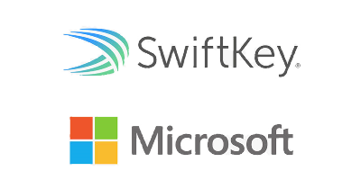
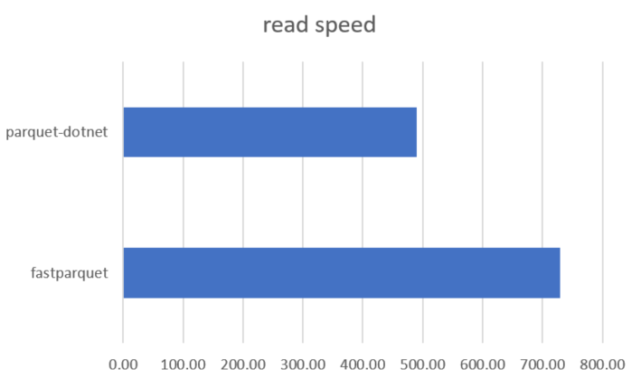

# Apache Parquet for .Net Platform


Note that [Elastacloud](https://elastacloud.com/Home) provides commercial support for Parquet.Net, therefore if you need any professional advise or speedy development of new features and bugfixes please write to [parquetsupport@elastacloud.com](mailto:parquetsupport@elastacloud.com).


## Status

[](https://www.nuget.org/packages/Parquet.Net)

| Core Build | Windows/Linux/Mac Tests |
|------------|----------------|
|[](https://aloneguid.visualstudio.com/AllPublic/_build/latest?definitionId=57)|[](https://aloneguid.visualstudio.com/Parquet.Net/_build/latest?definitionId=57)|

**Fully managed** .NET library to read and write [Apache Parquet](https://parquet.apache.org/) files. Supports:
- `.NET 4.5` and up.
- `.NET Standard 1.4` and up (for those who are in a tank that means it supports `.NET Core` (all versions) implicitly)

Runs on all flavors of Windows, Linux, MacOSXm mobile devices (iOS, Android) via [Xamarin](https://www.xamarin.com/), [gaming consoles](doc/xboxone.md) or anywhere .NET Standard runs which is a lot!

> Performs integration tests with **parquet-mr** (original Java parquet implementation) to test for identical behavior. We are planning to add more third-party platforms integration as well.

## Why

Parquet library is mostly available for [Java](https://github.com/apache/parquet-mr), [C++](https://github.com/apache/parquet-cpp) and [Python](https://github.com/dask/fastparquet), which somewhat limits .NET/C# platform in big data applications. Whereas C# is a beautiful language (C# is just Java done right) working on all platforms and devices, we still don't have anything good in this area. Note that [ParquetSharp](https://github.com/G-Research/ParquetSharp) provides a P/Invoke wrapper around parquet-cpp library, however it's a windows-only version with plenty of limitations around usability, is generally slower and leaks memory.

## Who

Parquet.Net is used by many small and large organisations for production workloads:

[](https://www.microsoft.com/en-us/swiftkey/about-us)

## Performance

How do we compare to other parquet implementations? We are fast and getting faster with every release. Parquet.Net is dedicated to low memory footprint, small GC pressure and low CPU usage. In this test we are using a file with **8 columns** and **150'000** rows, and the result is:



| |Parquet.Net (.NET Core 2.1)|Fastparquet (python)|parquet-mr (Java)|
|-|---------------------------|--------------------|-----------------|
|Read|14ms|22ms|151ms|
|Write (uncompressed)|4ms|26ms|617ms|
|Write (gzip)|11ms|200ms|1'974ms|

All the parties in this test were given 10 iteration and time was taken as an average. *Parquet-Mr* was even given a warm-up time being the slowest candidate, so it can fit on the chart.

## Index

- [Getting Started](#getting-started)
- [Reading Data](doc/reading.md) 
- [Writing Data](doc/writing.md)
- [Complex Types](doc/complex-types.md)
- [Row-Based API](doc/rows.md)
- [Fast Automatic Serialisation](doc/serialisation.md)
- [Declaring Schema](doc/schema.md)
  - [Supported Types](doc/types.md)
- **[parq!!!](doc/parq.md)**

You can track the [amount of features we have implemented so far](doc/features.md).

## Related Projects

- [Apache Parquet viewer for Windows 10](https://github.com/aloneguid/parquet-viewer-uwp).
- [Azure Data Lake Analytics Integration](https://github.com/elastacloud/datalake-extractor-parquet).

Download Parquet Viewer from Windows 10 store:

<a href="https://www.microsoft.com/store/apps/9pgb0m8z4j2t?ocid=badge"></a>

## Getting started

**Parquet.Net** is redistributed as a [NuGet package](https://www.nuget.org/packages/Parquet.Net). All the code is managed and doesn't have any native dependencies, therefore you are ready to go after referencing the package. This also means the library works on **Windows**, **Linux** and **MacOS X**.

### General

This intro is covering only basic use cases. Parquet format is more complicated when it comes to complex types like structures, lists, maps and arrays, therefore you should [read this page](doc/parquet-getting-started.md) if you are planning to use them.

### Reading files

In order to read a parquet file you need to open a stream first. Due to the fact that Parquet utilises file seeking extensively, the input stream must be *readable and seekable*. **You cannot stream parquet data!** This somewhat limits the amount of streaming you can do, for instance you can't read a parquet file from a network stream as we need to jump around it, therefore you have to download it locally to disk and then open.

For instance, to read a file `c:\test.parquet` you would normally write the following code:

```csharp
using System.Collections.Generic;
using System.IO;
using System.Linq;
using Parquet.Data;

// open file stream
using (Stream fileStream = System.IO.File.OpenRead("c:\\test.parquet"))
{
   // open parquet file reader
   using (var parquetReader = new ParquetReader(fileStream))
   {
      // get file schema (available straight after opening parquet reader)
      // however, get only data fields as only they contain data values
      DataField[] dataFields = parquetReader.Schema.GetDataFields();

      // enumerate through row groups in this file
      for(int i = 0; i < parquetReader.RowGroupCount; i++)
      {
         // create row group reader
         using (ParquetRowGroupReader groupReader = parquetReader.OpenRowGroupReader(i))
         {
            // read all columns inside each row group (you have an option to read only
            // required columns if you need to.
            DataColumn[] columns = dataFields.Select(groupReader.ReadColumn).ToArray();

            // get first column, for instance
            DataColumn firstColumn = columns[0];

            // .Data member contains a typed array of column data you can cast to the type of the column
            Array data = firstColumn.Data;
            int[] ids = (int[])data;
         }
      }
   }
}
```

### Writing files

Parquet.Net operates on streams, therefore you need to create it first. The following example shows how to create a file on disk with two columns - `id` and `city`.

```csharp
//create data columns with schema metadata and the data you need
var idColumn = new DataColumn(
   new DataField<int>("id"),
   new int[] { 1, 2 });

var cityColumn = new DataColumn(
   new DataField<string>("city"),
   new string[] { "London", "Derby" });

// create file schema
var schema = new Schema(idColumn.Field, cityColumn.Field);

using (Stream fileStream = System.IO.File.OpenWrite("c:\\test.parquet"))
{
   using (var parquetWriter = new ParquetWriter(schema, fileStream))
   {
      // create a new row group in the file
      using (ParquetRowGroupWriter groupWriter = parquetWriter.CreateRowGroup())
      {
         groupWriter.WriteColumn(idColumn);
         groupWriter.WriteColumn(cityColumn);
      }
   }
}
```

### Row-Based Access

Parquet.Net includes [API for row-based access](doc/rows.md) that simplify parquet programming at the expense of memory, speed and flexibility. We recommend using column based approacha when you can (examples above) however if not possible use these API as we constantly optimise for speed and use them internally outselves in certain situations.

## License

Parquet.Net is licensed under the [MIT license](https://github.com/elastacloud/parquet-dotnet/blob/master/LICENSE).

## Privacy

Your privacy is important to us. Full details are specified in the [privacy statement](/doc/PRIVACY.md). 

## Contributing

We are desparately looking for new contributors to this projects. It's getting a lot of good use in small to large organisations, however parquet format is complicated and we're out of resources to fix all the issues.

For details on how to start see [this guide](.github/CONTRIBUTING.md). If you are a developer who is interested in Parquet development please [read this guide](doc/parquet-getting-started.md)
