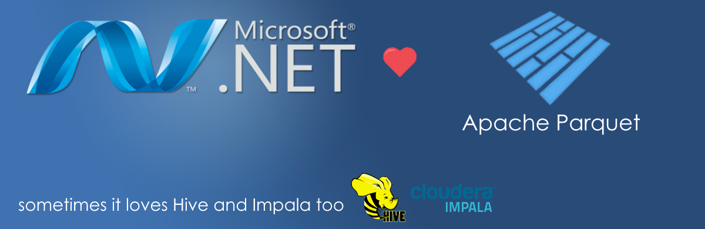

# Parquet.Net [](https://ci.appveyor.com/project/aloneguid/Parquet.Net) [](https://www.nuget.org/packages/Parquet.Net)



A .NET library to read and write [Apache Parquet](https://github.com/Parquet) files. Supports .NET 4.5.1 and .NET Standard 1.6.

## Why

Parquet library is mostly available for Java, C++ and Python, which somewhat limits .NET/C# platform in big data applications. Whereas C# is a great language we still don't have anything good in this area.

This project is aimed to fix this problem.

## Roadmap

This library is almost ready for production use and [contributors are welcome](CONTRIBUTING.md).

|Phase|Description|State|
|-----|-----------|-----|
|1|Implement reader which can understand the first test file (alltypes_plain.parquet). This is using a variety of encodings an no compression. Inline columns are not supported. Understand how to return results with minimum of boxing/unboxing. Support NULL values.|complete|
|2|Implement readers for any types not mentioned in phase 1. Implement writer for all types that reader supports. Support GZIP compression/decompression. Migrate to row-based data model. Publish first stable version on NuGet.|nearly there|
|3|Support filters i.e. reading a subset of parquet file by offset/count, and limited amount of columns. Support SNAPPY decompression/compression. |in progress|

You can track the amount of features we have [implemented so far](doc/features.md).

## Related Projects

Watch [this space](https://github.com/elastacloud/datalake-extractor-parquet) for [Azure Data Lake Analytics](https://azure.microsoft.com/en-us/services/data-lake-analytics/) Parquet extractor.

## Getting started

**Parquet.Net** is redistributed as a [NuGet package](https://www.nuget.org/packages/Parquet.Net) for `.NET 4.5.1` and `.NET Standard 1.6`. All code is managed and doesn't have any native dependencies, therefore you are ready to go after referencing the package.

### Reading files

In order to read a parquet file you need to open a stream first. Due to the fact that Parquet utilises file seeking extensively, the input stream must be *readable and seekable*. This somewhat limits the amount of streaming you can do, for instance you can't read a parquet file from a network stream as we need to jump around it, therefore you have to download it locally to disk and then open.

For instance, to read a file `c:\test.parquet` you woudl normally write the following code

```csharp
using System.IO;
using Parquet;
using Parquet.Data;

using(Stream fs = File.OpenRead("c:\\test.parquet"))
{
	using(var reader = new ParquetReader(fs))
	{
		DataSet ds = reader.Read();
	}
}
```

this will read entire file in memory as a set of rows inside `DataSet` class.

### Writing files

Parquet.Net operates on streams, therefore you need to create it first. The following example shows how to create a file on disk with two columns - `id` and `city`.

```csharp
using System.IO;
using Parquet;
using Parquet.Data;

var ds = new DataSet(
	new SchemaElement<int>("id"),
	new SchemaElement<string>("city")
);

ds.Add(1, "London");
ds.Add(2, "Derby");

using(Stream fileStream = File.OpenWrite("c:\\test.parquet"))
{
	using(var writer = new ParquetWriter(fileStream))
	{
		writer.Write(ds);
	}
}

```


## Tools

### parq

This tools gives a simple data inspector which lists out the columns found in a Parquet data set and the data values for those columns. 

To use, run ```dotnet parq.dll Mode=interactive InputFilePath=path/to/file.parquet DisplayMinWidth=10``` 

Arguments include:
* Mode (defaults to Interactive)
  * Interactive - breaks the dataset row-wise into folds and column-wise into sheets. Use the keyboard arrows to navigate the dataset
  * Full - displays all rows and columns of the dataset with no pause for user input. Limits the cell contents to the width of the header
  * Schema - displays no data, but lists all columns with their .NET type equivalent. Useful for inspecting content shape, for example when trying to build out model classes. 
* InputFilePath - path to the input parquet file
* DisplayMinWidth - as noted earlier, the interactive and full mode both display column contents up to the width of the header as we don't currently enumerate cell contents before beginning to draw. Setting DisplayMinWidth allows for long cell contents to be display.


## License

Parquet.Net is licensed under the [MIT license](https://github.com/elastacloud/parquet-dotnet/blob/master/LICENSE).

## Contributing

All contributions are welcome. For details on how to start see [this guide](CONTRIBUTING.md). If you are a developer who is interested in Parquet development please [read this guide](doc/parquet-getting-started.md)
