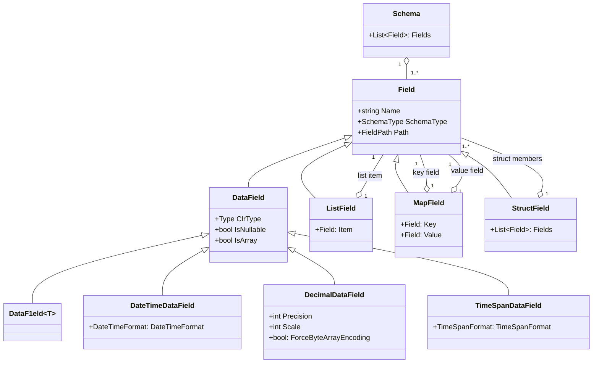
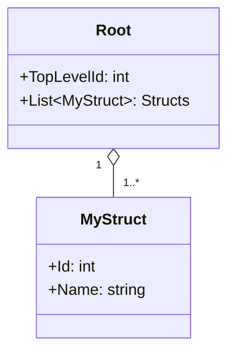

# Schema

Parquet is a format that stores data in a structured way. It has different types for different kinds of data, like numbers, strings, dates and so on. This means that you have to tell Parquet what type each column of your data is before you can write it to a file. This is called declaring a schema. Declaring a schema helps Parquet to compress and read your data more efficiently.

Schema can be defined by creating an instance of `ParquetSchema` class and passing a collection of `Field`. Various helper methods on both `DataSet` and `ParquetSchema` exist to simplify the schema declaration, but we are going to be more specific on this page.

There are several types of fields you can specify in your schema, and the most common is `DataField`. `DataField` is derived from the base abstract `Field` class (just like all the rest of the field types) and simply means in declares an actual data rather than an abstraction.

You can declare a `DataField` by specifying a column name, and it's type in the constructor, in one of two forms:

```C#
var field = new DataField("id", typeof(int));

var field = new Field<int>("id");
```

The first one is more declarative and allows you to select data type from the `DataType` enumeration containing the list of types we actually support at the moment.

The second one is just a shortcut to `DataField` that allows you to use .NET Generics.

<note>
In the older %product% versions you used to be able to declare the field as
<code-block lang="c#">
var field = new DataField("id", DataType.Int32);
</code-block>
which was deprecated and then removed. <code>DataType</code> enumeration existed when %product% did not support many features in the beginning of the project history, but nowadays almost every single CLR type is supported, therefore there is no need for extra enumeration.
</note>

Then, there are specialised versions for `DataField` allowing you to specify more precise metadata about certain parquet data type, for instance `DecimalDataField` allows to specify precision and scale other than default values.

Non-data field wrap complex structures like list (`ListField`), map (`MapField`) and struct (`StructField`).

Full schema type hierarchy can be expressed as:



## Lists

To declare a list, use `ListField` class and specify:
1. The name of the list field.
2. What data it is holding.

`ListField`'s second parameter is of type `Field`, meaning you can specify **anything** as it's member - a primitive `DataField` or anything else.

### Lists of primitive types

To declare a list of primitive types, just specify `DataField` as a second parameter. For instance, to declare a list of integers:

```c#
new ListField("item", new DataField<int>("id"));
```

<warning>

Parquet format allows you to use `arrays` which can also contain a list of primitive types. Whilst supported, it is strongly discouraged due to poor compatibility with other systems. In fact, it's impossible to find anything that will write arrays instead of lists, even for primitive types.

<chapter title="Using arrays (expand)" collapsible="true">

To declare an array, or a "repeatable field" in schema you need specify it as <code>IEnumerable&lt;T&gt;</code> where <code>T</code> is one of the types %product% supports. For example:

<code-block lang="c#">
var se = new DataField&lt;IEnumerable&lt;int&gt;&gt;("ids");
</code-block>

You can also specify that a field is repeatable by setting `isArray` in `DataField` constructor to `true`.

When writing to the field you can specify any value which derives from `IEnumerable<int>`, for instance

```C#
ds.Add(1, new int[] { 1, 2, 3 });
```

When reading schema back, you can check if it's repeatable by calling to `.IsArray` property.

You should always prefer lists to arrays because:
- Lists are more flexible - arrays can only contain a primitive type, whereas lists can contain anything.
- Most big data platforms just default to lists.
- Schema evolution is not possible with arrays.

</chapter>

</warning>

### Lists of structs

Of course a list can contain anything, but just to demostrate it can, this is how you would declare a list of structs:

<tabs>
<tab title="Data structure">



</tab>
<tab title="Schema definition">

```c#
var idField = new DataField<int>("Id");
var nameField = new DataField<string>("Name");

var schema = new ParquetSchema(
    new DataField<int>("TopLevelId"),
    new ListField("Structs",
        new StructField("MyStruct",
            idField,
            nameField)));
```

</tab>
</tabs>


## Special cases

### Null Values

Declaring schema as above will allow you to add elements of type `int`, however null values are not allowed (you will get an exception when trying to add a null value to the `DataSet`). In order to allow nulls you need to declare them in schema explicitly by specifying a nullable type:

```C#
new DataField<int?>("id");
// or
new DataField("id", typeof(int?));
```

This allows you to force the schema to be nullable, so you can add null values. In many cases having a nullable column is useful even if you are not using nulls at the moment, for instance when you will append to the file later and will have nulls.

Nullable columns incur a slight performance and data size overhead, as parquet needs to store an additional nullable flag for each value.

> Note that `string` type is always nullable. Although `string` is an [immutable type](https://docs.microsoft.com/en-us/dotnet/csharp/programming-guide/strings/) in CLR, it's still passed by reference, which can be assigned to `null` value.

### Dates

In the old times Parquet format didn't support dates, therefore people used to store dates as `int96` number. Because of backward compatibility issues we use this as the default date storage format.

If you need to override date format storage you can use `DateTimeDataField` instead of `DataField<DateTime>` which allows to specify precision, for example the following example lowers precision to only write date part of the date without time.

```C#
new DateTimeDataField("date_col", DateTimeFormat.Date);
```

see `DateTimeFormat` enumeration for detailed explanation of available options.

### Decimals

Writing a decimal by default uses precision 38 and scale 18, however you can set different precision and schema by using `DecimalDataField` schema element (see constructor for options).

Note that AWS Athena, Impala and possibly other systems do not conform to Parquet specifications when reading decimal fields. If this is the case, you must use `DecimalDataField` explicitly and set `forceByteArrayEncoding` to `true`.

For instance:

```C#
new DecimalDataField("decInt32", 4, 1); // uses precision 4 and scale 1

new DecimalDataField("decMinus", 10, 2, true); // uses precision 10 and scale 2, and enforces legacy decimal encoding that Impala understands
```

Since v4.2.3 variable-size decimal encoding [(variant 4)](https://github.com/apache/parquet-format/blob/master/LogicalTypes.md#decimal) is supported by the reader.
