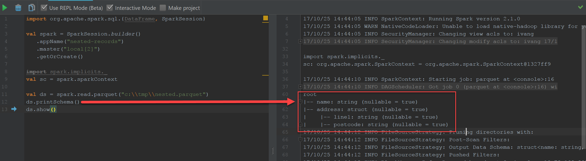
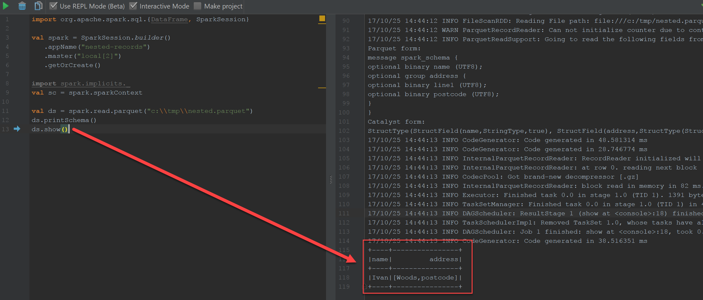

# Complex Data

The library supports reading and writing complex data since v1.5

## Arrays

To specify an array you can simply set schema type as `IEnumerable<T>`:

```csharp
var ds = new DataSet(
   new SchemaElement<int>("id"),
   new SchemaElement<IEnumerable<string>>("strings"));

ds.Add(1, new[] {"one", "two", "three"});
```

## Maps

Maps are represented as `IDictionary<TKey, TValue>` where both key and value must be a simple type (no structures are supported):

```csharp
var ds = new DataSet(
   new SchemaElement<IDictionary<int, string>>("names"),
   new SchemaElement<int>("id"));

ds.Add(new Dictionary<int, string>
{
   [1] = "one",
   [2] = "two",
   [3] = "three"
}, 1);
```

## Structures

In addition to [specifying basic types](schema.md), schema can contain complex structures. Let's say you have a table defined as:

```json
{
   "name": "Ivan",
   "addressLine1": "Woods",
   "addressPostcode": "postcode"
}
```

to save this data in parquet, you would define the following schema:

```csharp
var schema = new Schema(
   new SchemaElement<string>("name"),
   new SchemaElement<string>("addressLine1"),
   new SchemaElement<string>("addressPostcode"));
```

Although that's not pretty, it works perfectly fine. However, another way to express this data would be to have a separate **address** entity:

```json
{
   "name": "Ivan",
   "address": {
      "line1": "Woods",
      "postcode": "postcode"
   }
}
```

The corresponding schema definition is:

```csharp
var schema = new Schema(
   new SchemaElement<string>("name"),
   new SchemaElement<Row>("address",
      new SchemaElement<string>("line1"),
      new SchemaElement<string>("postcode")
);
```

Let's write a file out with one record to `c:\tmp\nested.parquet`:

```csharp
var ds = new DataSet(schema);

//add a new row
ds.Add("Ivan", new Row("Woods", "postcode"));

//write to file
ParquetWriter.WriteFile(ds, "c:\\tmp\\nested.parquet");
```

**name** element is expressed as a simple value, whereas because **address** is a nested structure, you have to specify a `Row` with values corresponding to the rows in that structure.

To validate this is working we can write a simple Scala Spark script:

```scala
import org.apache.spark.sql.{DataFrame, SparkSession}

val spark = SparkSession.builder()
   .appName("nested-records")
   .master("local[2]")
   .getOrCreate()

import spark.implicits._
val sc = spark.sparkContext

val ds = spark.read.parquet("c:\\tmp\\nested.parquet")
ds.printSchema()
ds.show()
```

which produces the following output for schema



and data



### Repeated Structures

Structures can be repeated as well (array of structures) by specifying them as `IEnumerable<Row>`:

```csharp
var ds = new DataSet(
   new SchemaElement<int>("id"),
   new SchemaElement<IEnumerable<Row>>("cities",
      new SchemaElement<string>("name"),
      new SchemaElement<string>("country")));

ds.Add(1, new[] { new Row("London", "UK"), new Row("New York", "US") });
```

### Nesting Structures

You can nest structures into structures on any level, for example:

```csharp
var ds = new DataSet(
   new SchemaElement<string>("name"),
   new SchemaElement<Row>("address",
      new SchemaElement<string>("name"),
      new SchemaElement<Row>("lines",
         new SchemaElement<string>("line1"),
         new SchemaElement<string>("line2"))));

ds.Add("Ivan", new Row("Primary", new Row("line1", "line2")));
```
