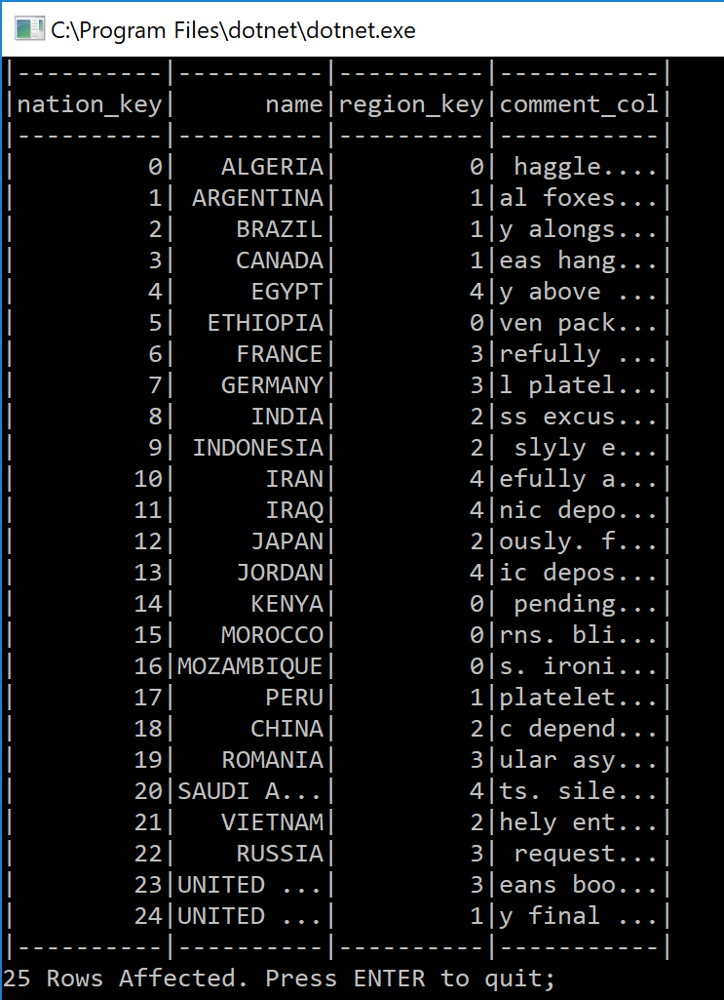

# Parq

This tools gives a simple data inspector which lists out the columns found in a Parquet data set and the data values for those columns. 

To use, run ```dotnet parq.dll Mode=interactive InputFilePath=path/to/file.parquet DisplayMinWidth=10``` 

Arguments include:
* Mode (defaults to Interactive)
  * Interactive - breaks the dataset row-wise into folds and column-wise into sheets. Use the keyboard arrows to navigate the dataset
  * Full - displays all rows and columns of the dataset with no pause for user input. Limits the cell contents to the width of the header
  * Schema - displays no data, but lists all columns with their .NET type equivalent. Useful for inspecting content shape, for example when trying to build out model classes. 
  * Rowcount - displays no data, but lists the rowcount of the parquet file
  * Head - takes the first n rows of the dataset (controlled by the Head property) and displays using the Full mode
  * Tail - takes the last n rows of the dataset (controlled by the Tail property) and displays using the Full mode
* InputFilePath - path to the input parquet file
* DisplayMinWidth (int: default 10) - as noted earlier, the interactive and full mode both display column contents up to the width of the header as we don't currently enumerate cell contents before beginning to draw. Setting DisplayMinWidth allows for long cell contents to be display.
* Expanded (bool: default False) - when a column value (individual cell) has a long body (longer than the header or the DisplayMinWidth) this setting removes the truncation of the cell (1234567...) and expands the column to the max column width of the whole dataset. Since it has to scan the whole dataset to find this max column width, there is a performance impact by setting this.
* DisplayNulls (bool: default True) - when a column value is null at the parquet level, the default (false) shows whitespace for the cell value, meaning it is a blank cell. However if a null and whitespace is a meaningful distinction (i.e. null means not entered, string.Empty means entered as blank), this setting when set to true will show a [null] placeholder for null values.
* TruncationIdentifer (string: default *) - in interactive mode only, if there are large columns by way of content which would wrap text based on the size of the console window (viewport), substring the cell and displays the supplied truncation identifier coloured yellow to identify as not from the original data. 
* Head (int) - controls the number of rows to take in Mode=Head
* Tail (int) - controls the number of rows to take in Mode=Tail

