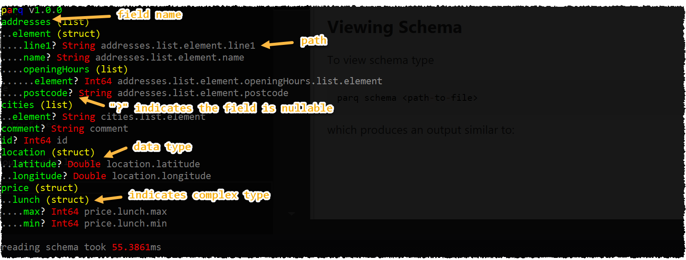

# PARQ (Global Tool)

Since v3.1 parquet repository includes an amazing [.NET Core Global Tool](https://docs.microsoft.com/en-us/dotnet/core/tools/global-tools) called **parq** which serves as a first class command-line client to perform various funtions on parquet files.

## Installing

Installing is super easy with *global tools*, just go to the terminal and type `dotnet tool install -g parq` and it's done. Note that you need to have at least **.NET Core 2.1 SDK** isntalled on your machine, which you probably have as a hero .NET developer.

## Commands

### Viewing Schema

To view schema type

```powershell
parq schema <path-to-file>
````

which produces an output similar to:



### Converting to JSON

```powershell
parq convert <path-to-file>
```

converts to multiline json, for instance:


```powershell
parq convert all_var1.parquet

{"addresses": [{"line1": "Dante Road", "name": "Head Office", "openingHours": [9, 10, 11, 12, 13, 14, 15, 16, 17, 18], "postcode": "SE11"}, {"line1": "Somewhere Else", "name": "Small Office", "openingHours": [6, 7, 19, 20, 21, 22, 23], "postcode": "TN19"}], "cities": ["London", "Derby"], "comment": "this file contains all the permunations for nested structures and arrays to test Parquet parser", "id": 1, "location": {"latitude": 51.2, "longitude": 66.3}, "price": {"lunch": {"max": 2, "min": 1}}}
{"addresses": [{"line1": "Dante Road", "name": "Head Office", "openingHours": [9, 10, 11, 12, 13, 14, 15, 16, 17, 18], "postcode": "SE11"}, {"line1": "Somewhere Else", "name": "Small Office", "openingHours": [6, 7, 19, 20, 21, 22, 23], "postcode": "TN19"}], "cities": ["London", "Derby"], "comment": "this file contains all the permunations for nested structures and arrays to test Parquet parser", "id": 1, "location": {"latitude": 51.2, "longitude": 66.3}, "price": {"lunch": {"max": 2, "min": 1}}}
```

you can optionally pretty-print the JSON output by specifying a `-p` parameter:

```powershell
parq convert struct_plain.parquet -p

[
{
  "isbn": "12345-6",
  "author": {
    "firstName": "Ivan",
    "lastName": "Gavryliuk"
  }
},
{
  "isbn": "12345-7",
  "author": {
    "firstName": "Richard",
    "lastName": "Conway"
  }
}]
```

As JSON is usually human readable you can use this command to view the file.

By default **parq** displays the first 10 rows of the source file, however you can override it with `--max-rows` option.


### More Commands

They are coming soon, please leave your comments in the issue tracker in terms of what you would like to see next.