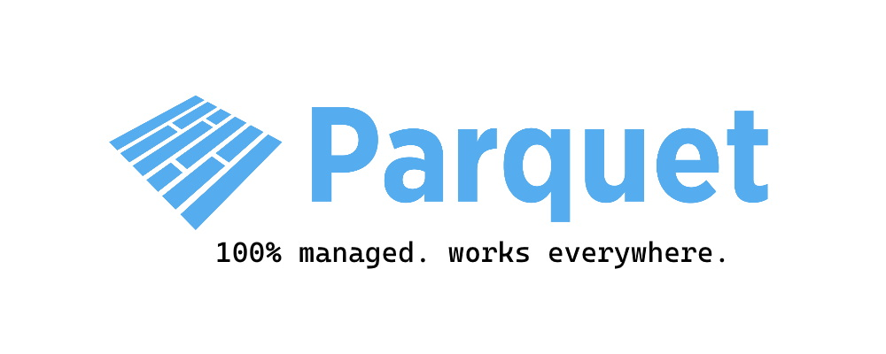

# Apache Parquet for .NET [](https://www.nuget.org/packages/Parquet.Net) [](https://www.nuget.org/packages/Parquet.Net)




---


**Fully portable, managed** .NET library to read and write [Apache Parquet](https://parquet.apache.org/) files. Supports `.NET 6.0`, `.NET Core 3.1`,  `.NET Standard 2.1` and `.NET Standard 2.0`.

Runs everywhere .NET runs Linux, MacOS, Windows, iOS, Android, Tizen, Xbox, PS4, Raspberry Pi, Samsung TVs and much more.

Support Web Assembly is coming (email me if you are interested in details).

## Why

Parquet is a de facto physical storage format in big data applications, including [Apache Spark](https://spark.apache.org/), as well as newly emerging [Delta Lake](https://delta.io/) and lakehouse architectures. It's really easy to read and write data if you are using one of those platforms, however in standalone mode it's almost impossible or involves using heavy engines. `Parquet.Net` is very small, fast, pure managed implementation that is crazy fast.

## Index

- [Getting Started](#getting-started)
- [Reading Data](reading.md) 
- [Writing Data](writing.md)
- [Declaring Schema](schema.md)
- [Complex Types](complex-types.md)
- [Row-Based API](rows.md)
- [Fast Automatic Serialisation](serialisation.md)

## Getting started

**Parquet.Net** is redistributed as a [NuGet package](https://www.nuget.org/packages/Parquet.Net). All the code is managed and doesn't have any native dependencies, therefore you are ready to go after referencing the package. This also means the library works on **Windows**, **Linux** and **MacOS X** (including M1).

### General

This intro is covering only basic use cases. Parquet format is more complicated when it comes to complex types like structures, lists, maps and arrays, therefore you should [read this page](parquet-getting-started.md) if you are planning to use them.

### Reading files

In order to read a parquet file you need to open a stream first. Due to the fact that Parquet utilises file seeking extensively, the input stream must be *readable and seekable*. **You cannot stream parquet data!** This somewhat limits the amount of streaming you can do, for instance you can't read a parquet file from a network stream as we need to jump around it, therefore you have to download it locally to disk and then open.

For instance, to read a file `c:\test.parquet` you would normally write the following code:

```csharp
// open file stream
using(Stream fileStream = System.IO.File.OpenRead("c:\\test.parquet")) {
    // open parquet file reader
    using(ParquetReader parquetReader = await ParquetReader.CreateAsync(fileStream)) {
        // get file schema (available straight after opening parquet reader)
        // however, get only data fields as only they contain data values
        DataField[] dataFields = parquetReader.Schema.GetDataFields();

        // enumerate through row groups in this file
        for(int i = 0; i < parquetReader.RowGroupCount; i++) {
            // create row group reader
            using(ParquetRowGroupReader groupReader = parquetReader.OpenRowGroupReader(i)) {
                // read all columns inside each row group (you have an option to read only
                // required columns if you need to.
                var columns = new DataColumn[dataFields.Length];
                for(int c = 0; c < columns.Length; c++) {
                    columns[c] = await groupReader.ReadColumnAsync(dataFields[c]);
                }

                // get first column, for instance
                DataColumn firstColumn = columns[0];

                // .Data member contains a typed array of column data you can cast to the type of the column
                Array data = firstColumn.Data;
                int[] ids = (int[])data;
            }
        }
    }
}
```

### Writing files

Writing operates on streams, therefore you need to create it first. The following example shows how to create a file on disk with two columns - `id` and `city`.

```csharp
//create data columns with schema metadata and the data you need
var idColumn = new DataColumn(
    new DataField<int>("id"),
    new int[] { 1, 2 });

var cityColumn = new DataColumn(
    new DataField<string>("city"),
    new string[] { "London", "Derby" });

// create file schema
var schema = new Schema(idColumn.Field, cityColumn.Field);

using(Stream fileStream = System.IO.File.OpenWrite("c:\\test.parquet")) {
    using(ParquetWriter parquetWriter = await ParquetWriter.CreateAsync(schema, fileStream)) {
        // create a new row group in the file
        using(ParquetRowGroupWriter groupWriter = parquetWriter.CreateRowGroup()) {
            await groupWriter.WriteColumnAsync(idColumn);
            await groupWriter.WriteColumnAsync(cityColumn);
        }
    }
}
```

### Row-Based Access

There are [API for row-based access](rows.md) that simplify parquet programming at the expense of memory, speed and flexibility. We recommend using column based approach when you can (examples above) however if not possible use these API as we constantly optimise for speed and use them internally ourselves in certain situations.

## Migrating from V3

The major difference between v4 and v3 is v4 fully migrated to async API. In most of the cases you will see an equivalent `Async` method instead of synchronous one. The only non-obvious places are:

1. Instead of `new ParquetReader(...)` you should use `await ParquetReader.CreateAsync(...)`.
2. Instead of `new ParquetWriter(...)` use `await ParquetWriter.CreateAsync(...)`.

## Who?

- [ML.NET](https://github.com/dotnet/machinelearning).
- Some parts of the popular [RavenDB NoSQL](https://ravendb.net/) database engine.
- Native Windows [Parquet Viewer app](https://github.com/mukunku/ParquetViewer).
- [Recfluence](https://github.com/markledwich2/Recfluence) YouTube analytics.

and [many more](https://github.com/aloneguid/parquet-dotnet/network/dependents). Want to be listed here? Just raise a PR.

## Contributions

Are welcome in any form - documentation, code, reviews, donations. 
