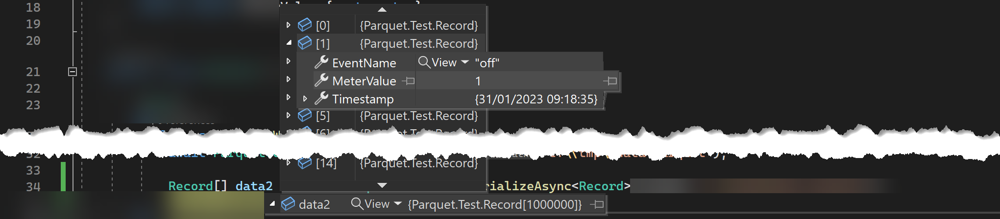

# Apache Parquet for .NET 
[](https://www.nuget.org/packages/Parquet.Net)
[](https://www.nuget.org/packages/Parquet.Net)


**Fully managed, safe, extremely fast** .NET library to 📖read and ✍️write [Apache Parquet](https://parquet.apache.org/) files designed for .NET world (not a wrapper). Targets `.NET 8`, `.NET 7`, `.NET 6.0`, `.NET Core 3.1`,  `.NET Standard 2.1` and `.NET Standard 2.0`.

Whether you want to build apps for Linux, MacOS, Windows, iOS, Android, Tizen, Xbox, PS4, Raspberry Pi, Samsung TVs or much more, Parquet.Net has you covered.

## Features at a glance

- 0️⃣ **Has zero dependencies** - pure library that just works anywhere .NET works i.e. desktops, servers, phones, watches and so on.
- 🚀**Really fast.** Faster than Python and Java, and alternative C# implementations out there. It's often even faster than native C++ implementations.
- 🏠**NET native.** Designed to utilise .NET and made for .NET developers, not the other way around.
- ❤️‍🩹**Not a "wrapper"** that forces you to fit in. It's the other way around - forces parquet to fit into .NET.
- 🦄**Unique Features**:
  - The only library that supports [dynamic](https://aloneguid.github.io/parquet-dotnet/writing.html) schemas.
  - Supports all parquet [types](https://aloneguid.github.io/parquet-dotnet/nested-types.html), encodings and compressions.
  - Fully supports [C# class serialization](https://aloneguid.github.io/parquet-dotnet/serialisation.html), for all simple and **complex** Parquet types.
  - Provides **low-level**, [high-level](https://aloneguid.github.io/parquet-dotnet/serialisation.html), and [untyped](https://aloneguid.github.io/parquet-dotnet/untyped-serializer.html) API.
  - Access to [file and column metadata](https://aloneguid.github.io/parquet-dotnet/metadata.html).
  - [Integration with DataFrames](https://aloneguid.github.io/parquet-dotnet/dataframe.html) (`Microsoft.Data.Analysis`).

## Quick start

Parquet is designed to handle *complex data in bulk*. It's *column-oriented* meaning that data is physically stored in columns rather than rows. This is very important for big data systems if you want to process only a subset of columns - reading just the right columns is extremely efficient.

As a quick start, suppose we have the following data records we'd like to save to parquet:

1. Timestamp.
2. Event name.
3. Meter value.

Or, to translate it to C# terms, this can be expressed as the following class:

```csharp
class Record {
    public DateTime Timestamp { get; set; }
    public string EventName { get; set; }
    public double MeterValue { get; set; }
}
```

### Writing data

Let's say you have around a million of events like that to save to a `.parquet` file. There are three ways to do that with this library, starting from easiest to hardest.

#### Writing with class serialisation

The first one is the easiest to work with, and the most straightforward. Let's generate those million fake records:

```csharp
var data = Enumerable.Range(0, 1_000_000).Select(i => new Record {
    Timestamp = DateTime.UtcNow.AddSeconds(i),
    EventName = i % 2 == 0 ? "on" : "off",
    MeterValue = i 
}).ToList();
```

Now, to write these to a file in say `/mnt/storage/data.parquet` you can use the following **line** of code:

```C#
await ParquetSerializer.SerializeAsync(data, "/mnt/storage/data.parquet");
```

That's pretty much it! You can [customise many things](serialisation.md) in addition to the magical magic process, but if you are a really lazy person that will do just fine for today.

#### Writing untyped data

Another way to serialise data is to use [Untyped serializer](untyped-serializer.md). 

#### Writing with low level API

And finally, the lowest level API is the third method. This is the most performant, most Parquet-resembling way to work with data, but least intuitive and involves some knowledge of Parquet data structures.

First of all, you need schema. Always. Just like in row-based example, schema can be declared in the following way:

```C#
var schema = new ParquetSchema(
    new DataField<DateTime>("Timestamp"),
    new DataField<string>("EventName"),
    new DataField<double>("MeterName"));
```

Then, data columns need to be prepared for writing. As parquet is column-based format, low level APIs expect that low level column slice of data. I'll just shut up and show you the code:

```C#
var column1 = new DataColumn(
    schema.DataFields[0],
    Enumerable.Range(0, 1_000_000).Select(i => DateTime.UtcNow.AddSeconds(i)).ToArray());

var column2 = new DataColumn(
    schema.DataFields[1],
    Enumerable.Range(0, 1_000_000).Select(i => i % 2 == 0 ? "on" : "off").ToArray());

var column3 = new DataColumn(
    schema.DataFields[2],
    Enumerable.Range(0, 1_000_000).Select(i => (double)i).ToArray());
```

Important thing to note here - `columnX` variables represent data in an entire column, all the values in that column independently from other columns. Values in other columns have the same order as well. So we have created three columns with data identical to the two examples above.

Time to write it down:

```C#
using(Stream fs = System.IO.File.OpenWrite("/mnt/storage/data.parquet")) {
    using(ParquetWriter writer = await ParquetWriter.CreateAsync(schema, fs)) {
        using(ParquetRowGroupWriter groupWriter = writer.CreateRowGroup()) {
            
            await groupWriter.WriteColumnAsync(column1);
            await groupWriter.WriteColumnAsync(column2);
            await groupWriter.WriteColumnAsync(column3);
        }
    }
}
```

**What's going on?**

1. We are creating output file stream. You can probably use one of the overloads in the next line though. This will be the receiver of parquet data. The stream needs to be writeable and seekable.
2. `ParquetWriter` is low-level class and is a root object to start writing from. It mostly performs coordination, check summing and enveloping of other data.
3. Row group is like a data partition inside the file. In this example we have just one, but you can create more if there are too many values that are hard to fit in computer memory.
4. Three calls to row group writer write out the columns. Note that those are performed sequentially, and in the same order as schema defines them.

Read more on writing [here](writing.md) which also includes guides on writing [nested types](nested_types.md) such as lists, maps, and structs.

### Reading data

Reading data also has three different approaches, so I'm going to unwrap them here in the same order as above.

#### Reading with class deserialisation

Provided that you have written the data, or just have some external data with the same structure as above, you can read those by simply doing the following:

```C#
IList<Record> data = await ParquetSerializer.DeserializeAsync<Record>("/mnt/storage/data.parquet");
```

This will give us an array with one million class instances similar to this:



Of course [class serialisation](serialisation.md) has more to it, and you can customise it further than that.

#### Reading untyped data

Read [here](untyped-serializer.md) for more information on how to read untyped data.

#### Reading with low level API

And with low level API the reading is even more flexible:

```C#
using(Stream fs = System.IO.File.OpenRead("/mnt/storage/data.parquet")) {
    using(ParquetReader reader = await ParquetReader.CreateAsync(fs)) {
        for(int i = 0; i < reader.RowGroupCount; i++) { 
            using(ParquetRowGroupReader rowGroupReader = reader.OpenRowGroupReader(i)) {

                foreach(DataField df in reader.Schema.GetDataFields()) {
                    DataColumn columnData = await rowGroupReader.ReadColumnAsync(df);

                    // do something to the column...
                }
            }
        }
    }
}
```

**This is what's happening**

1. Create read stream `fs`.
2. Create `ParquetReader` - root class for read operations.
3. The reader has `RowGroupCount` property which indicates how many row groups (like partitions) the file contains.
4. Explicitly open row group for reading.
5. Read each `DataField` from the row group, in the same order as it's declared in the schema.

> Uou can also use web based [reader app](https://aloneguid.github.io/parquet-online/) to test your files, which was created using this library!

## Choosing the API

If you have a choice, then the choice is easy - use Low Level API. They are the fastest and the most flexible. But what if you for some reason don't have a choice? Then think about this:

| Feature               | Class Serialisation | Untyped Serializer API | Low Level API            |
|-----------------------|---------------------|------------------------|--------------------------|
| Performance           | high                | very low               | very high                |
| Developer Convenience | C# native           | feels like Excel       | close to Parquet internals |
| Row based access      | easy                | easy                   | hard                     |
| Column based access   | C# native           | hard                   | easy                     |


## Keep reading

- [Serialisation](serialisation.md)
- [Writing](writing.md)
- [Reading](reading.md)
- Diving deeper
  - [Schema](schema.md)
  - [Column](column.md)
  - [Nested types](nested_types.md)
  - [Metadata](metadata.md)
- [Encodings](encodings.md)
- [Untyped serializer](untyped-serializer.md)
- [DataFrame](dataframe.md)
- [Utilities](utilities.md)
- Parquet Floor
  - [Parquet Floor basics](parquet-floor-basics.md)
- [Parquet getting started](parquet-getting-started.md)
- [Contributing](contributing.md)
- [Special thanks](Special-thanks.md)

## Used by

- [Azure Cosmos DB Desktop Data Migration Tool](https://github.com/AzureCosmosDB/data-migration-desktop-tool).
- [RavenDB - An ACID NoSQL Document Database](https://github.com/ravendb/ravendb).
- [Cinchoo ETL: An ETL framework for .NET](https://github.com/Cinchoo/ChoETL).
- [ParquetViewer: Simple Windows desktop application for viewing & querying Apache Parquet files](https://github.com/mukunku/ParquetViewer).
- [ML.NET: Machine Learning for .NET](https://github.com/dotnet/machinelearning).
- [PSParquet: PowerShell Module for Parquet](https://github.com/Agazoth/PSParquet).
- [Omni Loader: Self-tuning Database Migration Accelerator](https://www.omniloader.com).
- [Contoso Data Generator V2 : sample data generator](https://github.com/sql-bi/Contoso-Data-Generator-V2).
- [Recfuence - An analysis of YouTube's political influence through recommendations]().
- [Kusto-loco - C# KQL query engine with flexible I/O layers and visualization](https://github.com/NeilMacMullen/kusto-loco).
- [DeltaIO - Delta Lake implementation in pure .NET](https://github.com/aloneguid/delta).
- [Personal Data Warehouse - Import(Excel/Parquet/SQL/Fabric)-Transform(C#/Python)-Report(SSRS)](https://github.com/BlazorData-Net/PersonalDataWarehouse).
- [FastBCP - Export to parquet files in parallel from Oracle, SQL Server, MySQL, PostgreSQL, ODBC, Teradata, Netezza, SAP HANA, ClickHouse in one command line (Windows & Linux)](https://www.arpe.io/fastbcp/).


*...raise a PR to appear here...*

## Contributing

See the [contribution page](https://aloneguid.github.io/parquet-dotnet/contributing.html). The first important thing you can do is **simply star ⭐ this project**.
