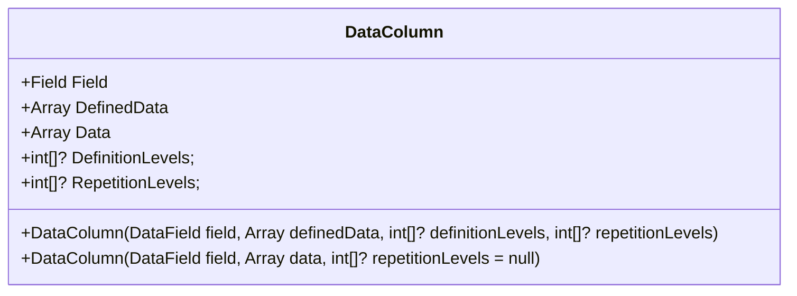
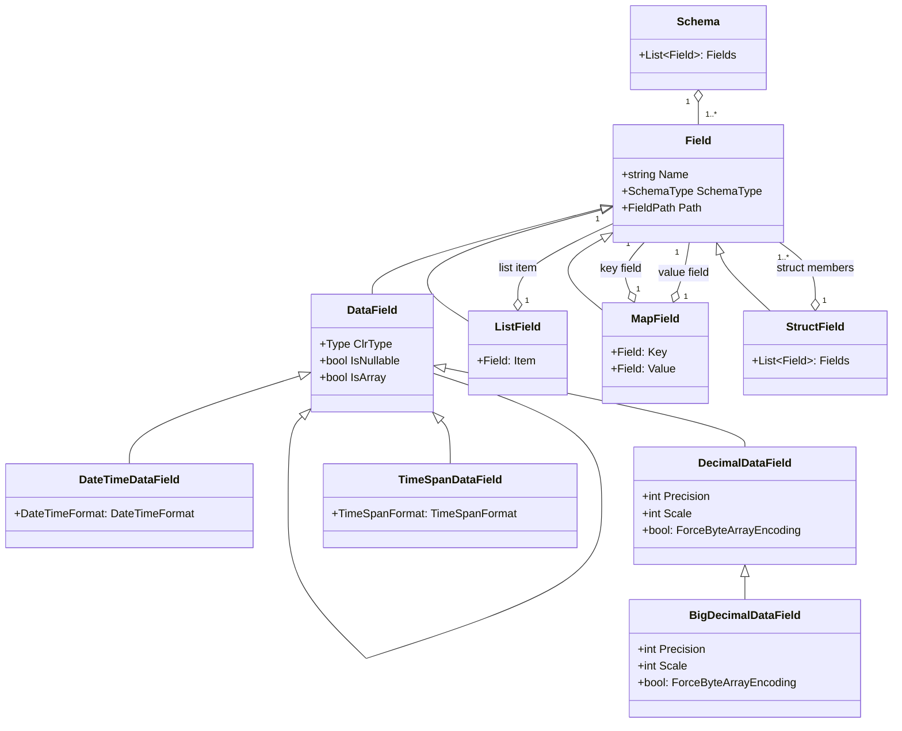
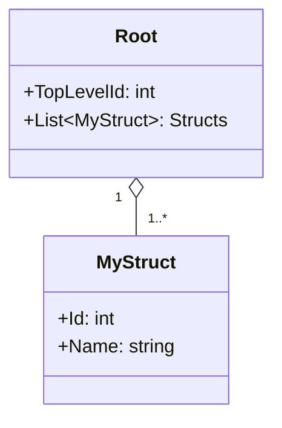
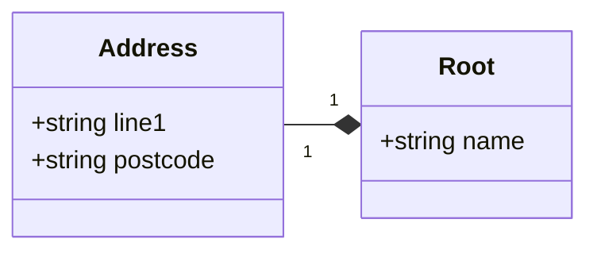
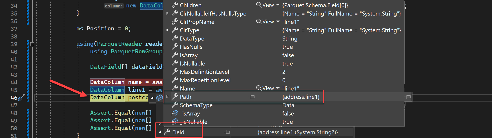
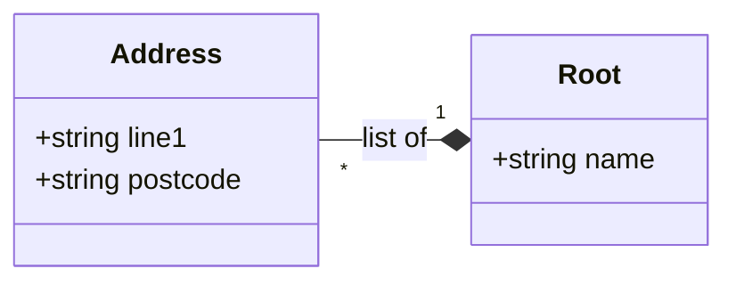

# Apache Parquet for .NET 
[](https://www.nuget.org/packages/Parquet.Net)
[](https://www.nuget.org/packages/Parquet.Net)


**Fully managed, safe, extremely fast** .NET library to 📖read and ✍️write [Apache Parquet](https://parquet.apache.org/) files designed for .NET world (not a wrapper). Targets `.NET 10`, `.NET 8`, `.NET 7`, `.NET 6.0`, `.NET Core 3.1`,  `.NET Standard 2.1` and `.NET Standard 2.0`.

Whether you want to build apps for Linux, MacOS, Windows, iOS, Android, Tizen, Xbox, PS4, Raspberry Pi, Samsung TVs or much more, Parquet.Net has you covered.

# Features at a glance

- 0️⃣ **Has zero dependencies** - pure library that just works anywhere .NET works i.e. desktops, servers, phones, watches and so on.
- 🚀**Really fast.** Faster than Python and Java, and alternative C# implementations out there. It's often even faster than native C++ implementations.
- 🏠**NET native.** Designed to utilise .NET and made for .NET developers, not the other way around.
- ❤️‍🩹**Not a "wrapper"** that forces you to fit in. It's the other way around — forces Parquet to fit into .NET.
- 🦄**Unique Features**:
  - The only library that supports dynamic schemas.
  - Supports all parquet types, encodings and compressions.
  - Fully supports [C# class serialization](#high-level-api), for all simple and **complex** Parquet types.
  - Provides **low-level**, high-level, and untyped API.
  - Access to file and column metadata
  - [Integration with DataFrames](#dataframe-support) (`Microsoft.Data.Analysis`).

# Table of Contents

<!-- TOC depthfrom:2 -->

- [Quick start](#quick-start)
    - [Low level API](#low-level-api)
    - [High level API](#high-level-api)
- [Customising serialization](#customising-serialization)
    - [Structures](#structures)
    - [Lists](#lists)
    - [Maps](#maps)
    - [Legacy Repeatable](#legacy-repeatable)
    - [Supported collection types](#supported-collection-types)
    - [Appending to files](#appending-to-files)
    - [Specifying row group size](#specifying-row-group-size)
    - [Ignoring property casing](#ignoring-property-casing)
- [Extra options](#extra-options)
- [Appending to files](#appending-to-files)
- [Parallelism](#parallelism)
- [Internals](#internals)
    - [DataColumn](#datacolumn)
    - [Schema](#schema)
        - [Lists](#lists)
        - [Lists of primitive types](#lists-of-primitive-types)
        - [Lists of structs](#lists-of-structs)
        - [Special cases](#special-cases)
    - [Nested types](#nested-types)
        - [Structs](#structs)
        - [Lists and Arrays](#lists-and-arrays)
        - [Lists](#lists)
        - [Lists of Structs](#lists-of-structs)
        - [Maps](#maps)
    - [Untyped Serializer](#untyped-serializer)
- [DataFrame Support](#dataframe-support)
- [Used by](#used-by)
- [Contributing](#contributing)
- [Special thanks](#special-thanks)

<!-- /TOC -->

## Quick start

Parquet is designed to handle *complex data in bulk*. It's *column-oriented* meaning that data is physically stored in **columns** rather than rows. This is very important for big data systems if you want to process only a subset of columns - reading just the right columns is extremely efficient.

Suppose we have the following data we'd like to save to a parquet file:

| Timestamp (`DateTime`) | Event name (`string`) | Meter value (`double`) |
| ---------------------- | --------------------- | ---------------------- |
| 2025-11-18 22:07:00    | start                 | 100                    |
| 2025-11-18 22:08:00    | stop                  | 500                    |
| 2025-11-18 22:09:00    | pause                 | 200                    |

### Low level API

Because parquet is a **columnar** format, you'd need to prepare 3 chunks of data, where each chunk is an array of values per column (first chunk is`[2025-11-18 22:07:00, 2025-11-18 22:08:00, 2025-11-18 22:09:00]` and so on). And because parquet is **strongly typed**, you also need to prepare a schema definition, declaring what type of data the file contains. Schema in Parquet.Net is represented as an instance of `ParquetSchema` class, which contains a collection of `DataField`s (columns):

```c#
var schema = new ParquetSchema(
    new DataField<DateTime>("Timestamp"),
    new DataField<string>("EventName"),
    new DataField<double>("MeterValue"));
```

The next step is to create `ParquetWriter` class, which builds parquet file skeleton inside the passed stream, and allows you to create a `ParquetRowGroupsWriter` that can write column data to the file. Row group in parquet is a group of all columns from the schema. A file can have any number of row groups, but there must be at least one present. If file is small enough (less than 64Mb or so) it will usually have a single row group. Row groups allow parquet files to contain massive amounts of data and also enable read parallelism (but not write parallelism), Each row group contains all the columns from the schema, but different "rows" or data. This is how you create a simple file with a single row group and write all 3 columns to it:

```c#
var column1 = new DataColumn(
    (DataField)schema[0],
    new[] { 
        new DateTime(2025, 11, 18, 22, 07, 00),
        new DateTime(2025, 11, 18, 22, 08, 00),
        new DateTime(2025, 11, 18, 22, 09, 00)});

var column2 = new DataColumn(
    (DataField)schema[1],
    new[] { "start", "stop", "pause" });

var column3 = new DataColumn(
    (DataField)schema[2],
    new[] { 12.34, 56.78, 90.12 });

using(Stream fs = System.IO.File.OpenWrite("/mnt/storage/data.parquet")) {
    using(ParquetWriter writer = await ParquetWriter.CreateAsync(schema, fs)) {
        using(ParquetRowGroupWriter groupWriter = writer.CreateRowGroup()) {
            
            await groupWriter.WriteColumnAsync(column1);
            await groupWriter.WriteColumnAsync(column2);
            await groupWriter.WriteColumnAsync(column3);
        }
    }
}
```

To read this file back (or just any file created with this or any other parquet software) you can do pretty much the reverse action:

```csharp
using(Stream fs = System.IO.File.OpenRead("/mnt/storage/data.parquet")) {
    using(ParquetReader reader = await ParquetReader.CreateAsync(fs)) {
        // optionally access schema: reader.Schema
        for(int i = 0; i < reader.RowGroupCount; i++) { 
            using(ParquetRowGroupReader rowGroupReader = reader.OpenRowGroupReader(i)) {

                foreach(DataField df in reader.Schema.GetDataFields()) {
                    DataColumn columnData = await rowGroupReader.ReadColumnAsync(df);

                    // do something to the column...
                }
            }
        }
    }
}
```

Just like with reading, you create `ParquetReader` on the source stream. Upon creating the stream, Parquet.Net reads stream metadata from the end of the file (hence the requirement for the source stream to have random access) and initializes the internal structures without reading any data. You can even access schema immediately by calling to `reader.Schema` to inspect it. Then enumerate row groups and read columns one by one.

### High level API

Quick start above is only scratching the surface, but already gets a bit too much. If memory or slight performance loss is less important than developer convenience, there are high level APIs available, which tries to mimic class serialization. Sample above can be rewritten by first declaring data type to hold all 3 schema fields:

```csharp
class Event {
    public DateTime Timestamp { get; set; }
    public string EventName { get; set; }
    public double MeterValue { get; set; }
}
```

Now let's generate some fake data:

```c#
var data = Enumerable.Range(0, 1_000_000).Select(i => new Event {
    Timestamp = DateTime.UtcNow.AddSeconds(i),
    EventName = i % 2 == 0 ? "on" : "off",
    MeterValue = i 
}).ToList();
```

And write these to a file:

```csharp
await ParquetSerializer.SerializeAsync(data, "/mnt/storage/data.parquet");
```

To read, simply call:

```c#
IList<Event> data = await ParquetSerializer.DeserializeAsync<Event>("/mnt/storage/data.parquet");
```

Class serialization is really fast as it generates [compiled expression trees](https://learn.microsoft.com/en-US/dotnet/csharp/programming-guide/concepts/expression-trees/) on the fly. That means there is a small delay when serializing the first entity, which in most cases is negligible. Once the class is serialized at least once, further operations become much faster (around ~40x compared to reflection on large amounts of data (~5 million records)).

> [!TIP]
> Class serialization philosophy is based on the idea that we don't need to reinvent the wheel when it comes to converting objects to and from JSON. Instead of creating our own custom serializers and deserializers, we can leverage the existing JSON infrastructure that .NET provides. This way, we can save time and effort, and also make our code more consistent and compatible with other .NET applications that use JSON.

Note that classes (or structs) in general purpose programming languages represent rows, but parquet is columnar. Therefore, there are natural limitations to what data structures are supported in parquet serialization:

- In order for the deserializer to work, classes need to have a parameterless constructor.
- Both properties and fields are supported, and naturally when serializing those need to be readable, and when deserializing they need to be writeable. This might limit your use cases if you are trying to deserialize into immutable objects, and in this case you should probably keep DTOs specifically designed for parquet format, which is still easier than using low level API.
- The deserializer does not "overwrite" class members; i.e. if you are deserializing into a list property and the default constructor already initializes the list with some values, the Parquet deserializer will append data to the list instead of overwriting it.
- While you can serialize `struct`, deserialization is only supported to `class` due to internal optimisation requirements.

## Customising serialization

Serialization tries to fit into the C# ecosystem like a ninja 🥷, including customizations. It supports the following attributes from [`System.Text.Json.Serialization` Namespace](https://learn.microsoft.com/en-us/dotnet/api/system.text.json.serialization?view=net-7.0):

- [`JsonPropertyName`](https://learn.microsoft.com/en-us/dotnet/api/system.text.json.serialization.jsonpropertynameattribute?view=net-7.0) - changes mapping of column name to property name. See also [ignoring property casing](#ignoring-property-casing).
- [`JsonIgnore`](https://learn.microsoft.com/en-us/dotnet/api/system.text.json.serialization.jsonignoreattribute?view=net-7.0) - ignores property when reading or writing. Alternatively, there is `[ParquetIgnore]`.
- [`JsonPropertyOrder`](https://learn.microsoft.com/en-us/dotnet/api/system.text.json.serialization.jsonpropertyorderattribute?view=net-6.0) - allows to reorder columns when writing to file (by default they are written in class definition order). Only root properties and struct (classes) properties can be ordered (it won't make sense to do the others).

Where built-in JSON attributes are not sufficient, extra attributes are added.

- `Enum` is supported by treating it as underlying type (by default it's `int`). There might be some improvements in future versions, such as mapping them to corresponding string values.
- [`string`](https://learn.microsoft.com/en-us/dotnet/api/system.string?view=net-8.0) in .NET is a reference type, which means it can be `null`. However, Parquet specification allows types to be declared _required or optional_. To fit into .NET ecosystem as closely as possible, this library will serialize .NET strings as _optional_ by default. If you want to change this behaviour, annotate string member with`[ParquetRequired]` attribute. Parquet.Net will also expect string to be optional when deserializing from a file and you will get an exception until you add `[ParquetRequired]` attribute to the relevant class property.
- Dates (`DateTime`) are serialized as `INT96` numbers, which include nanoseconds in the day. In general, `INT96` is obsolete in Parquet; however, older systems such as Impala and Hive are still actively using it to represent dates. Therefore, when this library sees an `INT96` type, it will automatically treat it as a date for both serialization and deserialization. If you prefer a non-legacy date type, annotate a property with `[ParquetTimestamp]`, which by default serializes dates with millisecond precision. If you need to increase precision, use the `[ParquetTimestamp]` attribute with an appropriate precision, like `[ParquetTimestamp(ParquetTimestampResolution.Microseconds)]`. Storing dates with microsecond precision relies on .NET `DateTime`, which can only store microseconds starting from .NET 7.
- `TimeSpan` is serialized with millisecond precision, but you can increase it by adding the `[ParquetMicroSecondsTime]` attribute.
- `decimal` is serialized with precision (number of digits in a number) of `38` and scale (number of digits to the right of the decimal point in a number) of `18`. If you need to use different precision/scale pair, use `[ParquetDecimal]` attribute, which allows to specify different precision and scale, i.e. `[ParquetDecimal(40, 20)]`.

You can also serialize [more complex types](https://github.com/apache/parquet-format/blob/master/LogicalTypes.md#nested-types) supported by the Parquet format, like lists or maps. These are called *nested types* and they can be useful for organizing your information. However, they also come with a trade-off: they make your code slower and use more CPU resources. That's why you should only use them when you really need them and not just because they look cool. Simple columns are faster and easier to work with, so stick to them whenever you can.

### Structures

> [!NOTE]
> Struct in Parquet is not the same as `struct` in C#. Parquet Struct represents a collection of data columns grouped together. In C# terms, Parquet struct is C# class (or C# struct).

Structures are just class members of a class and are completely transparent. Parquet.Net understands structures of any nesting level without any extra configuration. For instance, `AddressBookEntry` class may contain a structure called `Address`:

```C#
class Address {
    public string? Country { get; set; }
    public string? City { get; set; }
}

class AddressBookEntry {
    public string? FirstName { get; set; }
    public string? LastName { get; set; }   
    public Address? Address { get; set; }
}
```

### Lists

One of the interesting things about lists is that Parquet can handle any kind of data structure in a list. You can have a list of atoms, like `1, 2, 3`, or a list of lists, `[[1, 2], [3, 4], [5, 6]]`, or even a list of structures. For instance, a simple `MovementHistory` class with `Id` and list of `ParentIds` is totally natively supported:

```C#
class MovementHistory  {
    public int? PersonId { get; set; }
    public List<int>? ParentIds { get; set; }
}
```

Or as a more complicate example, here is a list of structures (classes in C#):

```C#
class Address {
    public string? Country { get; set; }
    public string? City { get; set; }
}

class MovementHistory {
    public int? PersonId { get; set; }
    public string? Comments { get; set; }
    public List<Address>? Addresses { get; set; }
}
```

By default, Parquet.Net assumes that <u>both lists and list elements are nullable</u>. This is because list is a class in .NET, and classes are nullable. Therefore, coming back to the previous example definition:

```c#
class MovementHistory {
    public List<Address>? Addresses { get; set; }
}
```

will produce the following [low-level schema](https://github.com/apache/parquet-format/blob/master/LogicalTypes.md#lists):

```
OPTIONAL group Addresses (LIST) {
  repeated group list {
    OPTIONAL group element {
        OPTIONAL binary Country (UTF8);
        OPTIONAL binary City (UTF8);
    }
  }
}
```

Usually this is not a problem, however you might encounter a problem when deserializing some files to handcrafted C# classes when nullability of the files and classes do not match the default.

To fix this, you can use `[ParquetRequired]` attribute on the list property:

```c#
class MovementHistory {
    [ParquetRequired]
    public List<Address>? Addresses { get; set; }
}
```

which will in turn produce the following low-level schema:

```
REQUIRED group Addresses (LIST) {
  repeated group list {
    OPTIONAL group element {
        OPTIONAL binary Country (UTF8);
        OPTIONAL binary City (UTF8);
    }
  }
}
```

As you can see, the "Addresses" container is now "required". If you also need to ensure that each element ("Address" instance) within the list is non-nullable (i.e., required), you can use the `[ParquetListElementRequired]` attribute on the property. This attribute controls the nullability of the list elements in the Parquet schema, marking them as required.

```c#
class MovementHistory {
    [ParquetRequired, ParquetListElementRequired]
    public List<Address>? Addresses { get; set; }
}
```

which will produce the following low-level schema:

```
REQUIRED group Addresses (LIST) {
  repeated group list {
    REQUIRED group element {
        OPTIONAL binary Country (UTF8);
        OPTIONAL binary City (UTF8);
    }
  }
}
```

### Maps

Maps are useful constructs to serialize key-value pairs where each row can have a different number of keys and they are not known beforehand. It's like duck typing in a strongly typed world. A property will be treated as a native Parquet map if its type is the generic `IDictionary<TKey, TValue>`.

### Legacy Repeatable

Parquet files can contain simple repeatable fields (AKA arrays) that store multiple values for a single column, which is not widely supported. To read an array of primitive values, use the `ParquetSimpleRepeatable` attribute on the property:

```C#
class Primitives {
    [ParquetSimpleRepeatable]
    public List<bool>? Booleans { get; set; }
}
```

> [!WARNING]
> Deserializing legacy repeatable fields incurs a massive performance penalty if arrays are large. Arrays are immutable in .NET, therefore every column value will re-create a new array of `Length + 1`, copy all the elements, and add one more.

### Supported collection types

Similar to JSON [supported collection types](https://learn.microsoft.com/en-us/dotnet/standard/serialization/system-text-json/supported-collection-types?pivots=dotnet-7-0), here are collections Parquet.Net currently supports:

| Type | Serialization | Deserialization |
| --- | --- | --- |
| Single-dimensional array (`T[]`) | ✔️ | ❌ |
| Multi-dimensional arrays | ❌ | ❌ |
| `IList<T>` | ✔️ | ❌ |
| `List<T>` | ✔️ | ✔️ |
| `IDictionary<TKey, TValue>` | ❌ | ❌ |
| `Dictionary<TKey, TValue>` | ✔️ | ✔️ |

`*` Technically impossible or very hard to implement.
`**` Technically possible, but not implemented yet.

### Appending to files

`ParquetSerializer` supports appending data to an existing Parquet file. This can be useful when you have multiple batches of data that need to be written to the same file.

To use this feature, you need to set the `Append` flag to `true` in the `ParquetSerializerOptions` object that you pass to the `SerializeAsync` method. This will tell the library to append the data batch to the end of the file stream instead of overwriting it. For example:

```C#
await ParquetSerializer.SerializeAsync(dataBatch, ms, new ParquetSerializerOptions { Append = true });
```

However, there is one caveat: you should not set the `Append` flag to `true` for the first batch of data that you write to a new file. This is because a Parquet file has a header and a footer that contain metadata about the schema and statistics of the data. If you try to append data to an empty file stream, you will get an `IOException` because there is no header or footer to read from. Therefore, you should always set the `Append` flag to `false` for the first batch (or not pass any options, which makes it `false` by default) and then switch it to `true` for subsequent batches. For example:

```C#
// First batch
await ParquetSerializer.SerializeAsync(dataBatch1, ms, new ParquetSerializerOptions { Append = false });

// Second batch
await ParquetSerializer.SerializeAsync(dataBatch2, ms, new ParquetSerializerOptions { Append = true });

// Third batch
await ParquetSerializer.SerializeAsync(dataBatch3, ms, new ParquetSerializerOptions { Append = true });
```

By following this pattern, you can easily append data to a Parquet file using `ParquetSerializer`.

### Specifying row group size

Row groups are a logical division of data in a parquet file. They allow efficient filtering and scanning of data based on predicates. By default, all the class instances are serialized into a single row group, which is absolutely fine. If you need to set a custom row group size, you can specify it in `ParquetSerializerOptions` like so:

```C#
await ParquetSerializer.SerializeAsync(data, stream, new ParquetSerializerOptions { RowGroupSize = 10_000_000 });
```

Note that small row groups make parquet files very inefficient in general, so you should use this parameter only when you are absolutely sure what you are doing. For example, if you have a very large dataset that needs to be split into smaller files for distributed processing, you might want to use a smaller row group size to avoid having too many rows in one file. However, this will also increase the file size and the metadata overhead, so you should balance the trade-offs carefully.

### Ignoring property casing

Since v5.0 Parquet.Net supports ignoring property casing when deserializing data. This can be useful when you have a class with properties that have different casing than the column names in the parquet file. For example, if you have a class with properties like `FirstName` and `LastName`, but the parquet file has columns named `first_name` and `last_name`, you can use the `IgnorePropertyCasing` option to ignore the casing differences and match the properties with the columns. Here is an example:

```C#
class BeforeRename {
  public string? lowerCase { get; set; }
}

class AfterRename {
  public string? LowerCase { get; set; }
}

var data = Enumerable.Range(0, 1_000).Select(i => new BeforeRename {
    lowerCase = i % 2 == 0 ? "on" : "off"
}).ToList();

// serialize to memory stream
using var ms = new MemoryStream();
await ParquetSerializer.SerializeAsync(data, ms);
ms.Position = 0;

// this will deserialize the data, but `LowerCase` property will be null, because it does not exist in the parquet file.
IList<AfterRename> data2 = await ParquetSerializer.DeserializeAsync<AfterRename>(ms);

// this will successfully deserialize the data, because property names are case insensitive
IList<AfterRename> data3 = await ParquetSerializer.DeserializeAsync<AfterRename>(ms,
    new ParquetSerializerOptions { PropertyNameCaseInsensitive = true });
```

## Extra options

- **Compression** can be selected after constructing `ParquetWriter`, where compression method `CompressionMethod` and/or compression level ([`CompressionLevel`](https://learn.microsoft.com/en-us/dotnet/api/system.io.compression.compressionlevel?view=net-7.0)) can be set. They default to `Snappy`, which is very reasonable.
- **Metadata** reading and writing is supported on both parquet reader and writer.
- **Statistics** can be read on a particular row group at zero cost by calling to `GetStatistics(DataField field)`.
- You can find other useful options in `ParquetOptions` class that can always be supplied to reader, writer, and serializer.

## Appending to files

Pseudo appending to files is supported, however it's worth keeping in mind that *row groups are immutable* by design, therefore the only way to append is to create a new row group at the end of the file. It's worth mentioning that small row groups make data compression and reading extremely ineffective, therefore the larger your row group the better.

The following code snippet illustrates this:

```C#
//write a file with a single row group
var schema = new ParquetSchema(new DataField<int>("id"));
var ms = new MemoryStream();

using(ParquetWriter writer = await ParquetWriter.CreateAsync(schema, ms)) {
    using(ParquetRowGroupWriter rg = writer.CreateRowGroup()) {
        await rg.WriteColumnAsync(new DataColumn(schema.DataFields[0], new int[] { 1, 2 }));
    }
}

//append to this file. Note that you cannot append to existing row group, therefore create a new one
ms.Position = 0;    // this is to rewind our memory stream, no need to do it in real code.
using(ParquetWriter writer = await ParquetWriter.CreateAsync(schema, ms, append: true)) {
    using(ParquetRowGroupWriter rg = writer.CreateRowGroup()) {
        await rg.WriteColumnAsync(new DataColumn(schema.DataFields[0], new int[] { 3, 4 }));
    }
}

//check that this file now contains two row groups and all the data is valid
ms.Position = 0;
using(ParquetReader reader = await ParquetReader.CreateAsync(ms)) {
    Assert.Equal(2, reader.RowGroupCount);

    using(ParquetRowGroupReader rg = reader.OpenRowGroupReader(0)) {
        Assert.Equal(2, rg.RowCount);
        Assert.Equal(new int[] { 1, 2 }, (await rg.ReadColumnAsync(schema.DataFields[0])).Data);
    }

    using(ParquetRowGroupReader rg = reader.OpenRowGroupReader(1)) {
        Assert.Equal(2, rg.RowCount);
        Assert.Equal(new int[] { 3, 4 }, (await rg.ReadColumnAsync(schema.DataFields[0])).Data);
    }

}
```

Note that you have to specify that you are opening `ParquetWriter` in **append** mode in its constructor explicitly - `new ParquetWriter(new Schema(id), ms, append: true)`. Doing so makes parquet.net open the file, find the file footer and delete it, rewinding current stream position to the end of actual data. Then, creating more row groups simply writes data to the file as usual, and `.Dispose()` on `ParquetWriter` generates a new file footer, writes it to the file and closes down the stream.

Please keep in mind that row groups are designed to hold a large amount of data (50000 rows on average) therefore try to find a large enough batch to append to the file. Do not treat parquet file as a row stream by creating a row group and placing 1-2 rows in it, because this will both increase file size massively and cause a huge performance degradation for a client reading such a file.

## Parallelism

File streams are generally not compatible with parallel processing. You can, however, open file stream per parallel thread i.e. your `Parallel.For` should perform file opening operation. Or you can introduce a lock on file read, depends on what works better for you. I might state the obvious here, but asynchronous and parallel are not the same thing.

Here is an example of reading a file in parallel, where a unit of parallelism is a row group:

```C#
var reader = await ParquetReader.CreateAsync(path);
var count = reader.RowGroupCount;

await Parallel.ForAsync(0, count,
    async (i, cancellationToken) => {
        // create an instance of a row group reader for each group
        using (var gr = await ParquetReader.CreateAsync(path)) {
            using (var rgr = gr.OpenRowGroupReader(i)) {
              // process the row group ...
            }
        }
    }
);
```

## Internals

### DataColumn

`DataColumn` is an essential part for low-level serialization. It represents a column that has actual data and for simple records that contain atomic types (int, string etc.):



- `Field` is a schema field that defines this column that you can obtain from a schema you define.
- `DefinedData` is raw data that is defined by `Field`'s type. If field is nullable, `DefinedData` represents non-nullable values. On the other hand, `Data` represents data as-is, including nulls. If you are reading `DataColumn` and need to access the data, `Data` is the field. To access data as it's stored in parquet file, use `DefinedData`. The names are chosen mostly due to backward compatibility reasons.
- Going further, to access *repetition and definition levels* as they are stored in parquet file, use the corresponding `DefinitionLevels` and `RepetitionLevels` fields.

### Schema

Schema is defined by creating an instance of `ParquetSchema` class and passing a collection of `Field`s. There are several types of fields in schema, and the most common is `DataField`, derived from the base abstract `Field` class (just like all the rest of the field types) and simply means it declares an actual data rather than an abstraction.

You can declare a `DataField` by specifying a column name, and its type in the constructor, generic form is also supported:

```C#
var field1 = new DataField("id", typeof(int));
var field2 = new Field<int>("id");
```

There are specialised versions for `DataField` allowing to specify more precise metadata about certain parquet data type, for instance `DecimalDataField` allows to specify precision and scale other than default values.

Non-data field wrap complex structures like list (`ListField`), map (`MapField`) and struct (`StructField`).

Full schema type hierarchy can be expressed as:



#### Lists

To declare a list, use `ListField` class and specify:

1. The name of the list field.
2. What data it is holding.

`ListField`'s second parameter is of type `Field`, meaning you can specify **anything** as its member - a primitive `DataField` or anything else.

#### Lists of primitive types

To declare a list of primitive types, just specify `DataField` as a second parameter. For instance, to declare a list of integers:

```c#
new ListField("item", new DataField<int>("id"));
```

> [!WARNING]
> Parquet format allows you to use `arrays` which can also contain a list of primitive types. Whilst supported, it is strongly discouraged due to poor compatibility with other systems. In fact, it's impossible to find anything that will write arrays instead of lists, even for primitive types.
>
> To declare an array, or a "repeatable field" in schema you need specify it as `IEnumerable<T>` where `T` is one of the types Parquet.Net supports. For example:
>
> ```csharp
> var se = new DataField<IEnumerable<int>>("ids");
> ```
> You can also specify that a field is repeatable by setting `isArray` in `DataField` constructor to `true`.
>
> When writing to the field you can specify any value which derives from `IEnumerable<int>`, for instance
>
> ```C#
> ds.Add(1, new int[] { 1, 2, 3 });
> ```
>
> When reading schema back, you can check if it's repeatable by calling to `.IsArray` property.
>
> You should always prefer lists to arrays because:
>
> - Lists are more flexible - arrays can only contain a primitive type, whereas lists can contain anything.
> - Most big data platforms just default to lists.
> - Schema evolution is not possible with arrays.

#### Lists of structs

Of course a list can contain anything, but just to demonstrate it can, this is how you would declare a list of structs:




```c#
var idField = new DataField<int>("Id");
var nameField = new DataField<string>("Name");

var schema = new ParquetSchema(
    new DataField<int>("TopLevelId"),
    new ListField("Structs",
        new StructField("MyStruct",
            idField,
            nameField)));
```

#### Special cases

- **Null Values** by default are not allowed, and need to be declared explicitly by specifying a nullable type:

```C#
new DataField<int?>("id");
new DataField("id", typeof(int?));
```

- **Dates** are stored by default as `int96` number because of backward compatibility issues. To override date format storage you can use `DateTimeDataField` instead of `DataField<DateTime>` which allows to specify precision, for example the following example lowers precision to only write date part of the date without time.

```C#
new DateTimeDataField("date_col", DateTimeFormat.Date);
```

- **Decimal** by default uses precision 38 and scale 18, however you can set different precision and schema by using `DecimalDataField` schema element (see constructor for options).

### Nested types

#### Structs

Structures are the easiest to understand. A structure is simply a container with extra fields i.e. table inside a table cell. From parquet's point of view, there is no difference between a struct's column and top-level column, they are absolutely identical.

Structures are mostly used to logically separate entities and simplify naming for a user. To demonstrate, let's say you have the following very simple class hierarchy:




In tabular form, it can be represented like this

| name     | address.line1 | address.postcode |
| -------- | ------------- | ---------------- |
| (column) | (column)      | (column)         |

which is also identical to

| name   | address                                     |
| ------ | ------------------------------------------- |
| Column | **line1** (column) \| **postcode** (column) |

Each table still has 3 physical columns, they are just named differently.

To make schema for this, we'll use `StructField` which accepts other fields as children:

```C#
var schema = new ParquetSchema(
   new DataField<string>("name"),
   new StructField("address",
      new DataField<string>("line1"),
      new DataField<string>("postcode")
   ));
```

To write data, we use plain columns:

```C#
using var ms = new MemoryStream();
using(ParquetWriter writer = await ParquetWriter.CreateAsync(schema, ms)) {
    ParquetRowGroupWriter rgw = writer.CreateRowGroup();

    await rgw.WriteColumnAsync(
        new DataColumn(new DataField<string>("name"), new[] { "Joe" }));

    await rgw.WriteColumnAsync(
        new DataColumn(new DataField<string>("line1"), new[] { "Amazonland" }));

    await rgw.WriteColumnAsync(
        new DataColumn(new DataField<string>("postcode"), new[] { "AAABBB" }));
}

```

To read back, again, the data is in plain columns:

```C#
 ms.Position = 0;

using(ParquetReader reader = await ParquetReader.CreateAsync(ms)) {
    using ParquetRowGroupReader rg = reader.OpenRowGroupReader(0);

    DataField[] dataFields = reader.Schema.GetDataFields();

    DataColumn name = await rg.ReadColumnAsync(dataFields[0]);
    DataColumn line1 = await rg.ReadColumnAsync(dataFields[1]);
    DataColumn postcode = await rg.ReadColumnAsync(dataFields[2]);

    Assert.Equal(new[] { "Joe" }, name.Data);
    Assert.Equal(new[] { "Amazonland" }, line1.Data);
    Assert.Equal(new[] { "AAABBB" }, postcode.Data);
}
```

Note that the only indication that this is a part of struct is `Path` property in the read schema containing struct name:



#### Lists and Arrays

Arrays *aka repeatable fields* is a basis for understanding how more complex data structures work in Parquet.

`DataColumn` in Parquet can contain not just a single but multiple values. Sometimes they are called repeated fields (because the data type value repeats) or arrays. In order to create a schema for a repeatable field, let's say of type `int` you could use one of two forms:

```C#
var field = new DataField<IEnumerable<int>>("items");
```

To check if the field is repeated you can always test `.IsArray` Boolean flag.

Parquet columns are flat, so in order to store an array in the array which can only keep simple elements and not other arrays, you would *flatten* them. For instance to store two elements:

- `[1, 2, 3]`
- `[4, 5]`

in a flat array, it will look like `[1, 2, 3, 4, 5]`. And that's exactly how parquet stores them. Now, the problem starts when you want to read the values back. Is this `[1, 2]` and `[3, 4, 5]` or `[1]` and `[2, 3, 4, 5]`? There's no way to know without an extra information. Therefore, parquet also stores that extra information an an extra column per data column, which is called *repetition levels*. In the previous example, our array of arrays will expand into the following two columns:

| #    | Data Column | Repetition Levels Column |
| ---- | ----------- | ------------------------ |
| 0    | 1           | 0                        |
| 1    | 2           | 1                        |
| 2    | 3           | 1                        |
| 3    | 4           | 0                        |
| 4    | 5           | 1                        |

In other words - it is the level at which we have to create a new list for the current value. In other words, the repetition level can be seen as a marker of when to start a new list and at which level.

To represent this in C# code:

```C#
var field = new DataField<IEnumerable<int>>("items");
var column = new DataColumn(
   field,
   new int[] { 1, 2, 3, 4, 5 },
   new int[] { 0, 1, 1, 0, 1 });
```

#### Lists

Although arrays are useful, most of the systems write lists of data using `List` type. Unlike arrays, which can only contain primitive types, lists can contain anything. The most common use of lists is lists of structs.

#### Lists of Structs

To demonstrate, I'll come back to the beginning of this document, and slightly change the relationship. Now our `Root` class does not just contain `Address` structure, but a list of address structures:



And we'd like to save the following data:

```json
[
    {
        "name": "Joe",
        "addresses": [
            {
                "line1": "Amazonland",
                "postcode": "AAABBB"
            },
            {
                "line1": "Disneyland",
                "postcode": "CCCDDD"
            }
        ]
    },
    {
        "name": "Bob",
        "addresses": [
            {
	            "line1": "Cryptoland",
    	        "postcode": "EEEFFF"
            }
        ]
    }
]
```

Knowing how structs and arrays are serialized, we can flatten this hierarchy to the following form so that it can be saved to Parquet:

| name | RL   | addresses.list.element.line1 | RL   | addresses.list.element.postcode | RL   |
| ---- | ---- | ---------------------------- | ---- | ------------------------------- | ---- |
| Joe  |      | Amazonland                   | 0    | AAABBB                          | 0    |
| Bob  |      | Disneyland                   | 1    | CCCDDD                          | 1    |
|      |      | Cryptoland                   | 0    | EEEFFF                          | 0    |

where **RL** column indicated *repetition levels* of the column to the left.

`name` does not have any repetition levels as it's a normal plain simple column.

`line1` is a part of a list and it has a slightly longer name than usual. This is because of parquet [naming conventions for lists](https://github.com/apache/parquet-format/blob/master/LogicalTypes.md#lists). List must **always** annotate a **3-level** structure:

- Outer group, which is a name of your business property (`addresses`)
  - Middle level, always called **list** annotates repeatable field.
    - A field always called **element** that annotates the list contents. When lists contain a primitive type, this field is that type. In our case it's a structure called **element** containing two fields - `line1` and `postcode`.

If it feels complicated, it **IS**! Therefore general recommendation would be to use plain columns whenever possible. Nested types in parquet carry both mental and performance overhead 🤯

Moving on, let's declare a schema for this:

```C#
var nameField = new DataField<string>("name");
var line1Field = new DataField<string>("line1");
var postcodeField = new DataField<string>("postcode");

var schema = new ParquetSchema(
   nameField,
   new ListField("addresses",
   new StructField(ListField.ElementName,
      line1Field,
      postcodeField)));

```

One thing to note - `ListField` automatically assumes there will be an internal *middle level* called **list** so it's omitted from the schema declaration.

The struct is called `"element"` which is what `ListField.ElementName` constant is equal to. Theoretically you can name it anything you want, but common convention is recommended to be followed.

And the final thing is to create data for those 3 columns with their repetition levels:

```C#
var nameCol = new DataColumn(nameField, new string[] { "Joe", "Bob" });
var line1Col = new DataColumn(line1Field, new[] { "Amazonland", "Disneyland", "Cryptoland" }, new[] { 0, 1, 0 });
var postcodeCol = new DataColumn(postcodeField, new[] { "AAABBB", "CCCDDD", "EEEFFF" }, new[] { 0, 1, 0 });
```

Congrats, you have saved your first list!

You might have noticed that list schema allows you to specify any `Field` - and that's 100% correct. Lists can contain any element type, including other lists! The idea of saving lists of lists is identical to the above.

For more examples or just to run the above, please refer to unit tests in this project.

#### Maps

Maps are stored as lists of structures, where each structure has two elements - key and value. Theoretically you don't need maps at all; it's just a hint to the programming language to deserialize it in a more convenient way.


### Untyped Serializer

Untyped serializer gives this library the ability to write and read data without the need to define low-level column data or define classes. This is extremely useful for use case like:

- Reading data from a file where the schema is not known in advance (i.e. parquet file viewers, generic utilities).
- Writing parquet file converters, i.e. from parquet to JSON.

The main motivation points to develop untyped serializer are:

- Single codebase for class serializer and untyped dictionary serializer.
- Deserialization produces JSON-like structures in memory. These can be written back to JSON files as-is.
- Row API is an old legacy that is somewhat buggy and very hard to evolve and fix.

In this API, everything is `Dictionary<string, object>`. For a simple use-case, with the following schema:

```C#
var schema = new ParquetSchema(
    new DataField<int>("id"),
    new DataField<string>("city"));
```

you can write data like this:

```C#
var data = new List<Dictionary<string, object>> {
    new Dictionary<string, object> { { "id", 1 }, { "city", "London" } },
    new Dictionary<string, object> { { "id", 2 }, { "city", "Derby" } }
};

await ParquetSerializer.SerializeAsync(schema, data, stream);
```

For more examples, see `ParquetSerializerTests.cs` in the codebase. The documentation will evolve as this API gets more stable.

## `DataFrame` Support

[`Microsoft.Data.Analysis`](https://www.nuget.org/packages/Microsoft.Data.Analysis) is supported via additional [NuGet package](https://www.nuget.org/packages/Parquet.Net.Data.Analysis). Due to `DataFrame` being in general less functional than Parquet, only primitive (atomic) columns are supported at the moment. If `DataFrame` supports more functionality in future (see related links below), this integration can be extended. When reading and writing, this integration will ignore any columns that are not atomic (primitive). You only need to call `WriteAsync()` extension method on `DataFrame` and specify the destination stream to write it to, similarly you can use `System.IO.Stream`'s extension method to read from parquet stream into `DataFrame`

```C#
DataFrame df;
await df.WriteAsync(stream);
DataFrame dfr = await stream.ReadParquetAsDataFrameAsync();
```

- Original blog post "[An Introduction to DataFrame](https://devblogs.microsoft.com/dotnet/an-introduction-to-dataframe/)".
- External GitHub Issues
  - [DataFrame (Microsoft.Data.Analysis) Tracking Issue](https://github.com/dotnet/machinelearning/issues/6144).
  - [DataFrame enhancements](https://github.com/dotnet/machinelearning/issues/6088).
  - [Add parquet support for importing and exporting data to/from DataFrame](https://github.com/dotnet/machinelearning/issues/5972).

## Used by

- [Azure Cosmos DB Desktop Data Migration Tool](https://github.com/AzureCosmosDB/data-migration-desktop-tool).
- [RavenDB - An ACID NoSQL Document Database](https://github.com/ravendb/ravendb).
- [Cinchoo ETL: An ETL framework for .NET](https://github.com/Cinchoo/ChoETL).
- [ParquetViewer: Simple Windows desktop application for viewing & querying Apache Parquet files](https://github.com/mukunku/ParquetViewer).
- [ML.NET: Machine Learning for .NET](https://github.com/dotnet/machinelearning).
- [PSParquet: PowerShell Module for Parquet](https://github.com/Agazoth/PSParquet).
- [Omni Loader: Self-tuning Database Migration Accelerator](https://www.omniloader.com).
- [Contoso Data Generator V2 : sample data generator](https://github.com/sql-bi/Contoso-Data-Generator-V2).
- [Recfuence - An analysis of YouTube's political influence through recommendations]().
- [Kusto-loco - C# KQL query engine with flexible I/O layers and visualization](https://github.com/NeilMacMullen/kusto-loco).
- [DeltaIO - Delta Lake implementation in pure .NET](https://github.com/aloneguid/delta).
- [Personal Data Warehouse - Import(Excel/Parquet/SQL/Fabric)-Transform(C#/Python)-Report(SSRS)](https://github.com/BlazorData-Net/PersonalDataWarehouse).
- [FastBCP - Export to parquet files in parallel from Oracle, SQL Server, MySQL, PostgreSQL, ODBC, Teradata, Netezza, SAP HANA, ClickHouse in one command line (Windows & Linux)](https://www.arpe.io/fastbcp/).
- [Parquet.FSharp](https://github.com/rob-earwaker/parquet-fsharp) - Extension of Parquet.Net that adds first-class support for F# types such as records, options, lists and discriminated unions.

*...raise a PR to appear here...*

## Contributing

Any contributions are welcome, in any form. Documentation, code, tests, or anything else. The first important thing you can do is simply star ⭐ this project.

## Special thanks

Without these tools development would be really painful.

- [Visual Studio Community](https://visualstudio.microsoft.com/vs/community/) - free IDE from Microsoft. The best in class C# and C++ development tool. It's worth using Windows just because Visual Studio exists there.
- [JetBrains Rider](https://www.jetbrains.com/rider/) - for their cross-platform C# IDE, which has some great features.
- [IntelliJ IDEA](https://www.jetbrains.com/idea/) - the best Python, Scala and Java IDE.
- [Benchmarkdotnet](https://benchmarkdotnet.org/) - the best cross-platform tool that can microbenchmark C# code. This library is faster than native ones only thanks for this.
- **You** starring ⭐ this project!
