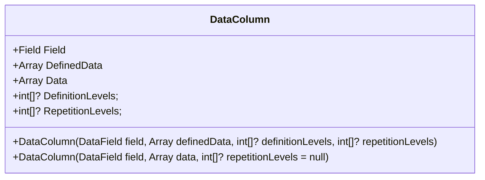

# DataColumn

`DataColumn` is an essential part for low-level serialization. It represents a column that has actual data.

For simple records that contain atomic types (int, string etc.) schema only consists of DataColumns.

Here is a sample logical representation of `DataColumn` class:

`Field` is a schema field that defines this column. You can obtain this field from a schema you define.

`DefinedData` is raw data that is defined by `Field`'s type. If your field is nullable, `DefinedData` represents non-nullable values. On the other hand, `Data` represents data as-is, including nulls. If you are reading `DataColumn` and need to access the data, `Data` is your field. If you need to access data as it's stored in parquet file, use `DefinedData`. The names are chosen mostly due to backward compatibility reasons.

Going further, if you need to access *repetition and definition levels* as they are stored in parquet file, you can use the corresponding `DefinitionLevels` and `RepetitionLevels` fields.

## Creating DataColumn

There are two public constuctors available (see above diagram). For convenience and backward compatibility, the second constuctor accepts `DataField` and two parameters:

1. `data` is data to write, including nulls if the field is nullable. DataColumn will decompose the data array into `DefinitionLevels` and `DefinedData` on construction.
2. `repetitionLevels` are only required if a field is a part of a nested type.

The first constructor is more granular and allows you to specify all three parts when constructing a colum.