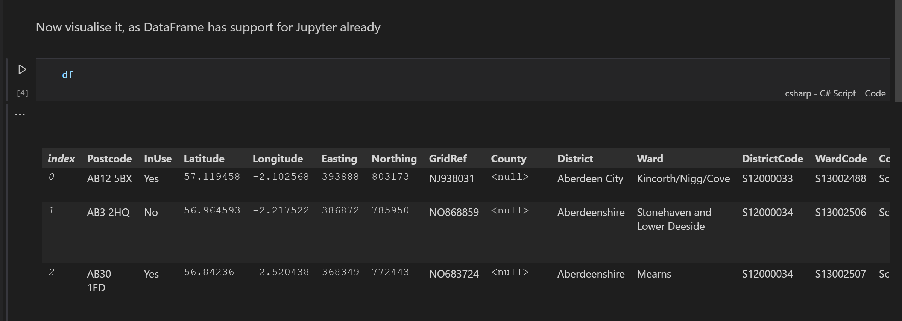

# DataFrame Support

Since v4.8 support for [`Microsoft.Data.Analysis`](https://www.nuget.org/packages/Microsoft.Data.Analysis) was added. 

## What's Supported?

Due to `DataFrame` being in general less functional than Parquet, only primitive (atomic) columns are supported at the moment. If `DataFrame` supports more functionality in future (see related links below), this integration can be extended. 

When reading and writing, this integration will ignore any columns that are not atomic.

## Writing

There is magic happening under the hood, but as a user you only need to call `WriteAsync()` extension method on `DataFrame` and specify the destination stream to write it to, like so:

```csharp
DataFrame df;
await df.WriteAsync(stream);
```

## Reading

As with writing, the magic is already done under the hood, so you can use `System.IO.Stream`'s extension method to read from parquet stream into `DataFrame`

```csharp
DataFrame df = await fs.ReadParquetAsDataFrameAsync();
```

## Samples

For your convenience, there is a [sample Jupyter notebook](../notebooks/read_dataframe.ipynb) available that demonstrates reading parquet files into `DataFrame` and displaying them:

[](../notebooks/read_dataframe.ipynb)


In order to run this notebook, you can use [VS Code](https://code.visualstudio.com/) with [Polyglot Notebooks extension](https://marketplace.visualstudio.com/items?itemName=ms-dotnettools.dotnet-interactive-vscode). 

## Related Links

- Original blog post "[An Introduction to DataFrame](https://devblogs.microsoft.com/dotnet/an-introduction-to-dataframe/)".
- External GitHub Issues
  - [DataFrame (Microsoft.Data.Analysis) Tracking Issue](https://github.com/dotnet/machinelearning/issues/6144).
  - [DataFrame enhancements](https://github.com/dotnet/machinelearning/issues/6088).
  - [Add parquet support for importing and exporting data to/from DataFrame](https://github.com/dotnet/machinelearning/issues/5972).