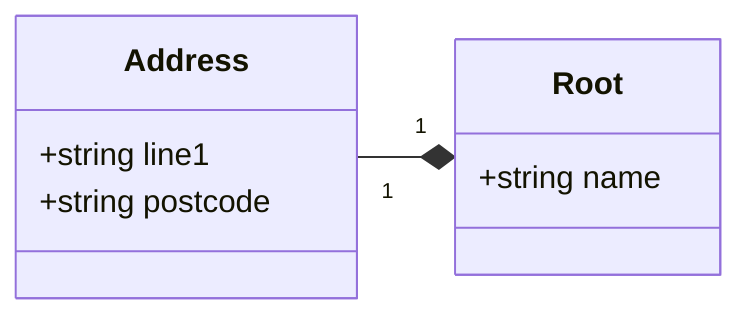
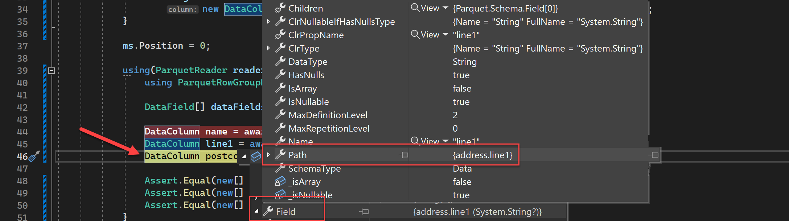
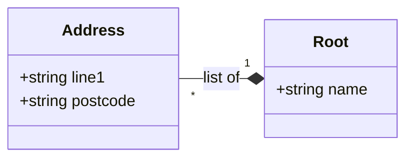

# Nested Types

Optionally (but not required) read [getting started with Parquet](parquet-getting-started.md) to better understand Parquet internals.

## Structs

Structures are the easiest to understand. A structure is simply a container with extra fields i.e. table inside a table cell. From parquet's point of view, there is no difference between a struct's column and top-level column, they are absolutely identical.

Structures are mostly used to logically separate entities and simplify naming for a user. To demonstrate, let's say you have the following very simple class hierarchy:




In tabular form, it can be represented like this

| name     | address.line1 | address.postcode |
| -------- | ------------- | ---------------- |
| (column) | (column)      | (column)         |

which is also identical to

| name   | address                                     |
| ------ | ------------------------------------------- |
| Column | **line1** (column) \| **postcode** (column) |

Each table still has 3 physical columns, they are just named differently.

To make schema for this, we'll use `StructField` which accepts other fields as children:

```csharp
var schema = new ParquetSchema(
   new DataField<string>("name"),
   new StructField("address",
      new DataField<string>("line1"),
      new DataField<string>("postcode")
   ));
```

To write data, we use plain columns:

```csharp
using var ms = new MemoryStream();
using(ParquetWriter writer = await ParquetWriter.CreateAsync(schema, ms)) {
    ParquetRowGroupWriter rgw = writer.CreateRowGroup();

    await rgw.WriteColumnAsync(
        new DataColumn(new DataField<string>("name"), new[] { "Joe" }));

    await rgw.WriteColumnAsync(
        new DataColumn(new DataField<string>("line1"), new[] { "Amazonland" }));

    await rgw.WriteColumnAsync(
        new DataColumn(new DataField<string>("postcode"), new[] { "AAABBB" }));
}

```

To read back, again, the data is in plain columns:

```csharp
 ms.Position = 0;

using(ParquetReader reader = await ParquetReader.CreateAsync(ms)) {
    using ParquetRowGroupReader rg = reader.OpenRowGroupReader(0);

    DataField[] dataFields = reader.Schema.GetDataFields();

    DataColumn name = await rg.ReadColumnAsync(dataFields[0]);
    DataColumn line1 = await rg.ReadColumnAsync(dataFields[1]);
    DataColumn postcode = await rg.ReadColumnAsync(dataFields[2]);

    Assert.Equal(new[] { "Joe" }, name.Data);
    Assert.Equal(new[] { "Amazonland" }, line1.Data);
    Assert.Equal(new[] { "AAABBB" }, postcode.Data);
}
```

Note that the only indication that this is a part of struct is `Path` property in the read schema containing struct name:



## Lists and Arrays

Arrays *aka repeatable fields* is a basis for understanding how more complex data structures work in Parquet.

`DataColumn` in Parquet can contain not just a single but multiple values. Sometimes they are called repeated fields (because the data type value repeats) or arrays. In order to create a schema for a repeatable field, let's say of type `int` you could use one of two forms:

```csharp
var field = new DataField<IEnumerable<int>>("items");
```
To check if the field is repeated you can always test `.IsArray` Boolean flag.

Parquet columns are flat, so in order to store an array in the array which can only keep simple elements and not other arrays, you would *flatten* them. For instance to store two elements:

- `[1, 2, 3]`
- `[4, 5]`

in a flat array, it will look like `[1, 2, 3, 4, 5]`. And that's exactly how parquet stores them. Now, the problem starts when you want to read the values back. Is this `[1, 2]` and `[3, 4, 5]` or `[1]` and `[2, 3, 4, 5]`? There's no way to know without an extra information. Therefore, parquet also stores that extra information an an extra column per data column, which is called *repetition levels*. In the previous example, our array of arrays will expand into the following two columns:

| #    | Data Column | Repetition Levels Column |
| ---- | ----------- | ------------------------ |
| 0    | 1           | 0                        |
| 1    | 2           | 1                        |
| 2    | 3           | 1                        |
| 3    | 4           | 0                        |
| 4    | 5           | 1                        |

In other words - it is the level at which we have to create a new list for the current value. In other words, the repetition level can be seen as a marker of when to start a new list and at which level.

To represent this in C# code:

```csharp
var field = new DataField<IEnumerable<int>>("items");
var column = new DataColumn(
   field,
   new int[] { 1, 2, 3, 4, 5 },
   new int[] { 0, 1, 1, 0, 1 });
```

### Lists

Although arrays are useful, most of the systems write lists of data using `List` type. Unlike arrays, which can only contain primitive types, lists can contain anything. The most common use of lists is lists of structs.

### Lists of Structs

To demonstrate, I'll come back to the beginning of this document, and slightly change the relationship. Now our `Root` class does not just contain `Address` structure, but a list of address structures:



And we'd like to save the following data:

```json
[
    {
        "name": "Joe",
        "addresses": [
            {
                "line1": "Amazonland",
                "postcode": "AAABBB"
            },
            {
                "line1": "Disneyland",
                "postcode": "CCCDDD"
            }
        ]
    },
    {
        "name": "Bob",
        "addresses": [
            {
	            "line1": "Cryptoland",
    	        "postcode": "EEEFFF"
            }
        ]
    }
]
```

Knowing how structs and arrays are serialised, we can flatten this hierarchy to the following form so that it can be saved to Parquet:

| name | RL   | addresses.list.element.line1 | RL   | addresses.list.element.postcode | RL   |
| ---- | ---- | ---------------------------- | ---- | ------------------------------- | ---- |
| Joe  |      | Amazonland                   | 0    | AAABBB                          | 0    |
| Bob  |      | Disneyland                   | 1    | CCCDDD                          | 1    |
|      |      | Cryptoland                   | 0    | EEEFFF                          | 0    |

where **RL** column indicated *repetition levels* of the column to the left.

`name` does not have any repetition levels as it's a normal plain simple column.

`line1` is a part of a list and it has a slightly longer name than usual. This is because of parquet [naming conventions for lists](https://github.com/apache/parquet-format/blob/master/LogicalTypes.md#lists). List must **always** annotate a **3-level** structure:

- Outer group, which is a name of your business property (`addresses`)
  - Middle level, always called **list** annotates repeatable field.
    - A field always called **element** that annotates the list contents. When lists contain a primitive type, this field is that type. In our case it's a structure called **element** containing two fields - `line1` and `postcode`.

If it feels complicated, it **IS**! Therefore general recommendation would be to use plain columns whenever possible. Nested types in parquet carry both mental and performance overhead 🤯

Moving on, let's declare a schema for this:

```csharp
var nameField = new DataField<string>("name");
var line1Field = new DataField<string>("line1");
var postcodeField = new DataField<string>("postcode");

var schema = new ParquetSchema(
   nameField,
   new ListField("addresses",
   new StructField(ListField.ElementName,
      line1Field,
      postcodeField)));

```

One thing to note - `ListField` automatically assumes there will be an internal *middle level* called **list** so it's omitted from the schema declaration.

The struct is called `"element"` which is what `ListField.ElementName` constant is equal to. Theoretically you can name it anything you want, but common convention is recommended to be followed.

And the final thing is to create data for those 3 columns with their repetition levels:

```csharp
var nameCol = new DataColumn(nameField, new string[] { "Joe", "Bob" });
var line1Col = new DataColumn(line1Field, new[] { "Amazonland", "Disneyland", "Cryptoland" }, new[] { 0, 1, 0 });
var postcodeCol = new DataColumn(postcodeField, new[] { "AAABBB", "CCCDDD", "EEEFFF" }, new[] { 0, 1, 0 });
```

Congrats, you have saved your first list!

You might have noticed that list schema allows you to specify any `Field` - and that's 100% correct. Lists can contain any element type, including other lists! The idea of saving lists of lists is identical to the above.

For more examples or just to run the above, please refer to unit tests in this project.

## Maps

Maps are stored as lists of structures, where each structure has two elements - key and value. Theoretically you don't need maps at all, it's just a hint to programming language to deserialise it in a more convenient way. 

## I'm Fed Up

Yeah? Then just use [class serialisation](serialisation.md).
