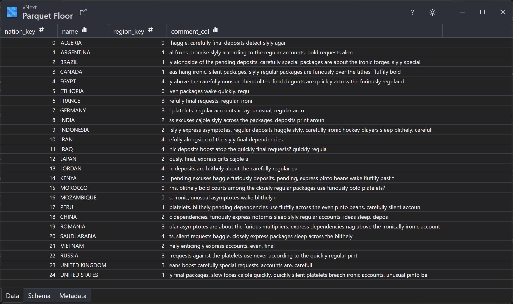

# Parquet Floor

**Floor** is a reference implementation of the desktop application to view Parquet files. It was created as a demonstration of what is possible with Parquet.Net library, and as a visual validator of parquet files for visual thinkers.

It is not a competitor to any other parquet viewers out there, quite possibly outshining Floor in terms of features and performance. However, it is a good starting point for anyone who wants to create their own parquet viewer.

## Features

- Visually pleasant and easy to use UI, supporting dark and light themes, available as a native application for Windows, Linux and MacOSX.
- View parquet files in a table-like view, with full support for nested structures, lists and maps.
- Explore parquet schema in a tree view.
- Explore parquet low-level metadata.
- Convert files to CSV format.

## Installing

There are no prerequisites to install Floor, simply download the latest version from the 
[releases section](https://github.com/aloneguid/parquet-dotnet/releases) and run it. Floor is a self-contained application, it does not require .NET runtime to be installed.

