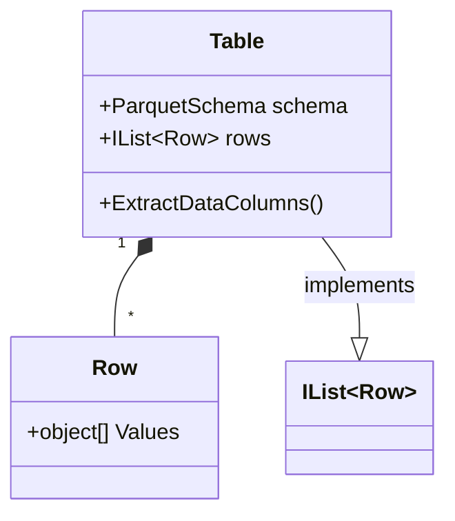

# Row Based Access

Parquet, of course, is columnar format, and doesn't store data in rows. However, sometimes accessing data in a row-wise fashion is essential in processing algorithms and to display to a user. We as humans better understand rows rather than columns.

Parquet.Net provides out-of-the-box helpers to represent data in row format, however before using it consider the following:

- Can you avoid using row based access? If yes, don't use row based access. 
- Row based helpers add a lot of overhead on top of parquet data as it needs to be transformed on the fly from columns to rows internally, and this cannot be done in performant way.
- If your data access code is slow, this is probably because you are using row based access which is relatively slow.

## Table

Table is at the root of row-based hierarchy. A table is simply a collection of `Row`s, and by itself implements `IList<Row>` interface. This means that you can perform any operations you normally do with `IList<T>` in .NET. A row is just a collection of untyped objects:



## Row

Row is a central structure to hold data during row-based access. Essentially a row is an array of untyped objects. The fact that the row holds untyped objects *adds a performance penalty on working with rows and tables* throught parquet, because all of the data cells needs to be boxed/unboxed for reading and writing. If you can work with *column-based data* please don't use row-based access at all. However, if you absolutely need row-based access, these helper classes are still better than writing your own helper classes.

**Everything in parquet file can be represented as a set of Rows** including plain flat data, arrays, maps, lists and structures.

## Flat Data

Representing flat data is the most obvious case, you would simply create a row where each element is a value of a row. For instance let's say you need to store a list of cities with their ids looking similar to this:

|id|city|
|--|----|
|1|London|
|2|New York|

The corresponding code to create a table with rows is:

```csharp
var table = new Table(
   new Schema(
      new DataField<int>("id"),
      new DataField<string>("city")));

table.Add(new Row(1, "London"));
table.Add(new Row(2, "New York"));
```

Both `ParquetReader` and `ParquetWriter` has plenty of extension methods to read and write tables.

## Arrays (Repeatable fields)

Parquet has an option to store an array of values in a single cell, which is sometimes called a *repeatable field*. With row-based access you can simply add an array to each cell. For instance let's say you need to create the following table:

|ids|
|---|
|1,2,3|
|4,5,6|

The corresponding code to populate this table is:

```csharp
var table = new Table(
   new Schema(
      new DataField<IEnumerable<int>>("ids")));

table.Add(new Row(new[] { 1, 2, 3 }));
table.Add(new Row(new[] { 4, 5, 6 }));

```

## Dictionaries (Maps)

```csharp
var schema = new Schema(
   new DataField<string>("city"),
   new MapField("population",
      new DataField<int>("areaId"),
      new DataField<long>("count")));
```

and you need to write a row that has *London* as a city and *population* is a map of *234=>100, 235=>110*.

The table should look like:

|         |Column 0|Column 1|
|---------|--------|--------|
|**Row 0**|London|`List<Row>`|

where the last cell is the data for your map. As we're in the row-based world, this needs to be represented as a list of rows as well:

|         |Column 0|Column 1|
|---------|--------|--------|
|**Row 0**|234|100|
|**Row 1**|235|110|

To express this in code:

```csharp
table.Add("London",
   new List<Row>
   {
      new Row(234, 100L),
      new Row(235, 110L)
   });
```

## Structures

Structures are represented again as `Row` objects. When you read or write a structure it is embedded into another row's value as a row. To demonstrate, the following schema

```csharp
var table = new Table(
   new Schema(
      new DataField<string>("isbn"),
      new StructField("author",
         new DataField<string>("firstName"),
         new DataField<string>("lastName"))));
```

represents a table with two columns - *isbn* and *author*, however *author* is a structure of two fields - *firstName* and *lastName*. To add the following data into the table

|isbn|author|
|----|------|
|12345-6|Hazel; Nut|
|12345-8|Marsha; Mellow|

you would write:

```csharp
table.Add(new Row("12345-6", new Row("Hazel", "Nut")));
table.Add(new Row("12345-7", new Row("Marsha", "Mellow")));
```

## Lists

Lists are easy to get confused with repeatable fields, because they essentially repeat some data in a cell. This is true for a simple data type like a string, int etc., however lists are special in a way that a list item can be anything else, not just a plain data type. In general, *when repeated data can be represented as a plain type, always use repeatable field*. Repeatable fields are lighter and faster than lists which have extra overhead on serialisation and performance.

### Simple Lists

In simple cases, when a list contains a single data element, it will be mapped to a collection of those elements, for instance in the following schema

```csharp
var table = new Table(
   new Schema(
      new DataField<int>("id"),
      new ListField("cities",
         new DataField<string>("name"))));
```

and the following set of data:

|id|cities|
|--|------|
|1|London, Derby|
|2|Paris, New York|

can be represented in code as:

```csharp
table.Add(1, new[] { "London", "Derby" });
table.Add(2, new[] { "Paris", "New York" });
```

As you can see, it's no different to repeatable fields (in this case a repeatable string) however it will perform much slower due to transformation costs are higher.

### Lists of Structures

A more complicated use case of lists where they actually make some sense is using structures (although lists can contain any subclass of `Field`). Let's say you have the the following schema definition:

```csharp
var t = new Table(
   new DataField<int>("id"),
   new ListField("structs",
      new StructField("mystruct",
         new DataField<int>("id"),
         new DataField<string>("name"))));
```

and would like to add the following data:

|id|structs|
|--|-------|
|1|id: 1, name: Joe; id: 2, name: Bloggs|
|1|id: 3, name Star; id: 4, name: Wars|

which essentially creates a list of structures with two fields - id and name in a single table cell. To add the data to the table:

```csharp
t.Add(1, new[] { new Row(1, "Joe"), new Row(2, "Bloggs") });
t.Add(2, new[] { new Row(3, "Star"), new Row(4, "Wars") });
```


## ToString Overloads

`.ToString()` overloads on both `Table` and `Row` format data in *single-line, single-quote JSON* for your convenience. For instance, `table.ToString()` may produce following results:

```json
{'id': 1, 'strings': ['1', '2', '3']}
{'id': 2, 'strings': []}
{'id': 3, 'strings': ['1', '2', '3']}
{'id': 4, 'strings': []}
```

which means that this table contains 4 rows, each row is a single-line JSON document. All the rows are separated by a line break character. This decision was made based on the fact that multiline JSON can be read directly by Apache Spark, and it's much more easier to parse a large document by splitting it by line separator character to get the next row.

Single quotes are chosen only based on the fact that in C# language it's hard to encode strings for tests with double quotes as you need to escape them. However, you can produce double quotes by using `ToString` overload and passing `"j"` as a format string, like `.ToString("j")`.